# Sơ đồ hệ thống PerfumeShop (Mermaid)

Tài liệu tổng hợp toàn bộ sơ đồ của hệ thống: kiến trúc, ERD, chức năng, luồng nghiệp vụ và trạng thái.
Nguồn: đọc trực tiếp từ source code backend (entity, service, controller) và frontend.

---

## 1. Kiến trúc tổng thể

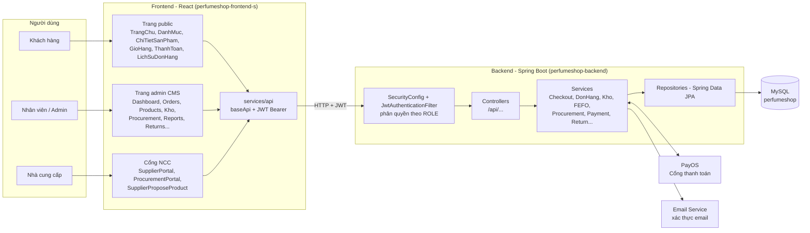

---

## 2. Sơ đồ thực thể quan hệ (ERD)

```mermaid
erDiagram
    NGUOI_DUNG {
        int id_nguoi_dung PK
        string ten_dang_nhap UK
        string mat_khau_bam
        string ho_ten
        string so_dien_thoai
        string dia_chi
        string email
        boolean is_verified
        string vai_tro "CUSTOMER | SUPPLIER"
        string verification_token
        datetime token_expiry_time
    }

    NHAN_VIEN {
        int id_nhan_vien PK
        string ten_dang_nhap UK
        string mat_khau_bam
        string ho_ten
        string vai_tro "ADMIN | DIRECTOR | STORE_MANAGER | WAREHOUSE_STAFF"
    }

    DANH_MUC {
        int id_danh_muc PK
        string ten_danh_muc
    }

    THUONG_HIEU {
        int id_thuong_hieu PK
        string ten_thuong_hieu UK
        string url_hinh_anh
    }

    SAN_PHAM {
        int id_san_pham PK
        string ten_san_pham
        string mo_ta
        string url_hinh_anh
        decimal gia_ban
        int dung_tich_ml
        int nong_do
        int so_luong_ton_kho
        int so_luong_hang_loi
        int phan_tram_giam
        datetime ngay_bat_dau_giam
        datetime ngay_ket_thuc_giam
        int id_danh_muc FK
        int id_thuong_hieu FK
    }

    SU_KIEN {
        int id_su_kien PK
        string ten_su_kien
        string banner_url
        datetime ngay_bat_dau
        datetime ngay_ket_thuc
        boolean trang_thai_active
        decimal giam_gia_hang_loat
    }

    SU_KIEN_SAN_PHAM {
        int id_su_kien FK
        int id_san_pham FK
    }

    DON_HANG {
        int id_don_hang PK
        int id_nguoi_dung FK
        int id_nhan_vien FK
        string trang_thai_van_hanh "Dang cho | Da xac nhan | Dang giao | Hoan thanh | Da huy | Cho hang"
        string trang_thai_thanh_toan "Chua TT | Cho TT | Da TT | Da hoan tien"
        decimal tong_tien
        string ma_van_don
        string so_dien_thoai
        string phuong_thuc_thanh_toan "COD | online"
        string ten_nguoi_nhan
        string dia_chi_giao_hang
        datetime ngay_dat_hang
        datetime ngay_hoan_thanh
        string ly_do_huy
        string ghi_chu
        int id_su_kien FK
        decimal giam_gia_hang_loat
    }

    CHI_TIET_DON_HANG {
        int id_chi_tiet_don_hang PK
        int id_don_hang FK
        int id_san_pham FK
        int so_luong
        decimal gia_tai_thoi_diem_mua
        int id_phieu FK "lô nhập FEFO - traceability"
    }

    PHIEU_NHAP_KHO {
        int id_phieu PK
        string ma_phieu UK
        int id_nhan_vien FK
        string nha_cung_cap
        datetime ngay_nhap
        string ghi_chu
        decimal gia_ban_chot
        string trang_thai "CHO_KHO_KIEM_TRA | CHO_ADMIN_DUYET | DA_NHAP | BI_TU_CHOI"
    }

    CHI_TIET_PHIEU_NHAP {
        int id PK
        int id_phieu FK
        int id_san_pham FK
        string ten_san_pham_snapshot
        int so_luong
        decimal gia_nhap
        int so_luong_thuc_nhan
        int so_luong_loi
        int so_luong_con_lai "FEFO"
        date han_su_dung
        string so_lo
        string url_hinh_anh_moi
        string ghi_chu_kho
    }

    PHIEU_NHAP_TAM {
        int id PK
        string id_session "UUID nhom upload"
        string ten_san_pham_csv
        int id_san_pham FK
        int so_luong
        decimal gia_nhap
        date han_su_dung
        string so_lo
        string trang_thai "OK | CHUA_MAP | LOI"
        string loi
        int dong_so
        datetime ngay_tao
    }

    BIEN_DONG_KHO {
        int id PK
        int id_san_pham FK
        string ten_san_pham_snapshot
        string loai "NHAP | XUAT_BAN | HOAN_KHO | XUAT_LOI | DIEU_CHINH"
        int so_luong
        int ton_kho_sau
        string ly_do
        int id_don_hang FK
        int id_phieu_nhap FK
        int id_nhan_vien FK
        datetime ngay_tao
    }

    PHIEU_GOI_THAU {
        int id_phieu_goi_thau PK
        string ma_phieu UK
        string trang_thai "OPEN | CLOSED"
        string ghi_chu
        date han_chot
        int id_nhan_vien_tao FK
        datetime ngay_tao
        datetime ngay_cap_nhat
    }

    CHI_TIET_GOI_THAU {
        int id_chi_tiet PK
        int id_phieu_goi_thau FK
        int id_san_pham FK
        string ten_san_pham_snapshot
        int so_luong_can_nhap
        int ton_kho_hien_tai
        decimal gia_ban_hien_tai
        string ghi_chu
    }

    BAO_GIA_NCC {
        int id_bao_gia PK
        int id_phieu_goi_thau FK
        string ten_ncc
        string lien_he_ncc
        string trang_thai "CHO_DUYET | TRUNG_THAU | ROT_THAU"
        decimal gia_nhap_de_xuat
        decimal phan_tram_bien_do
        decimal gia_ban_chot
        date han_su_dung
        string so_lo
        datetime ngay_tao
    }

    SAN_PHAM_DE_XUAT {
        int id_san_pham_de_xuat PK
        int id_phieu_goi_thau FK "null neu de xuat doc lap"
        string ten_ncc
        string lien_he_ncc
        string ten_san_pham
        string mo_ta
        string url_hinh_anh
        decimal gia_de_xuat
        int so_luong_co_the_cung_cap
        int dung_tich_ml
        int nong_do
        string trang_thai "PENDING | APPROVED | REJECTED"
        int id_san_pham_tao_ra FK
        int id_san_pham_khop FK
        date han_su_dung
        string so_lo
        string phan_hoi_admin
        datetime ngay_tao
        datetime ngay_xu_ly
        int id_nhan_vien_xu_ly FK
    }

    PHIEU_DOI_TRA {
        int id_doi_tra PK
        int id_don_hang FK
        int id_nguoi_dung FK
        int id_nhan_vien FK
        string ly_do
        string ly_do_tu_choi
        string ghi_chu_noi_bo
        decimal so_tien_hoan
        datetime ngay_hoan_tien
        string trang_thai "Cho duyet | Cho hoan tien | Hoan tien thanh cong | Tu choi"
        datetime ngay_tao
    }

    DANH_GIA_SAN_PHAM {
        int id_danh_gia PK
        int id_san_pham FK
        int id_nguoi_dung FK
        int diem_danh_gia
        string binh_luan
        datetime ngay_tao
    }

    %% ── Quan hệ ──
    DANH_MUC ||--o{ SAN_PHAM : "phan loai"
    THUONG_HIEU ||--o{ SAN_PHAM : "thuoc"

    NGUOI_DUNG ||--o{ DON_HANG : "dat"
    NHAN_VIEN ||--o{ DON_HANG : "xu ly"
    DON_HANG ||--|{ CHI_TIET_DON_HANG : "gom"
    SAN_PHAM ||--o{ CHI_TIET_DON_HANG : "duoc mua"
    PHIEU_NHAP_KHO ||--o{ CHI_TIET_DON_HANG : "lo FEFO gan khi dat"
    SU_KIEN ||--o{ DON_HANG : "ap dung"
    SU_KIEN ||--o{ SU_KIEN_SAN_PHAM : ""
    SAN_PHAM ||--o{ SU_KIEN_SAN_PHAM : ""

    NHAN_VIEN ||--o{ PHIEU_NHAP_KHO : "tao / duyet"
    PHIEU_NHAP_KHO ||--|{ CHI_TIET_PHIEU_NHAP : "gom"
    SAN_PHAM ||--o{ CHI_TIET_PHIEU_NHAP : "duoc nhap"
    SAN_PHAM ||--o{ PHIEU_NHAP_TAM : "map"

    SAN_PHAM ||--o{ BIEN_DONG_KHO : "lich su ton kho"
    DON_HANG ||--o{ BIEN_DONG_KHO : "phat sinh"
    PHIEU_NHAP_KHO ||--o{ BIEN_DONG_KHO : "phat sinh"

    NHAN_VIEN ||--o{ PHIEU_GOI_THAU : "tao"
    PHIEU_GOI_THAU ||--|{ CHI_TIET_GOI_THAU : "gom"
    SAN_PHAM ||--o{ CHI_TIET_GOI_THAU : "can nhap"
    PHIEU_GOI_THAU ||--o{ BAO_GIA_NCC : "nhan bao gia"
    PHIEU_GOI_THAU |o--o{ SAN_PHAM_DE_XUAT : "de xuat trong phieu"
    SAN_PHAM |o--o{ SAN_PHAM_DE_XUAT : "tao ra / khop"
    NHAN_VIEN ||--o{ SAN_PHAM_DE_XUAT : "duyet"

    DON_HANG ||--o{ PHIEU_DOI_TRA : "yeu cau"
    NGUOI_DUNG ||--o{ PHIEU_DOI_TRA : "tao"
    NHAN_VIEN ||--o{ PHIEU_DOI_TRA : "xu ly"

    SAN_PHAM ||--o{ DANH_GIA_SAN_PHAM : "duoc danh gia"
    NGUOI_DUNG ||--o{ DANH_GIA_SAN_PHAM : "viet"
```

---

## 3. Sơ đồ chức năng theo vai trò (Use Case)

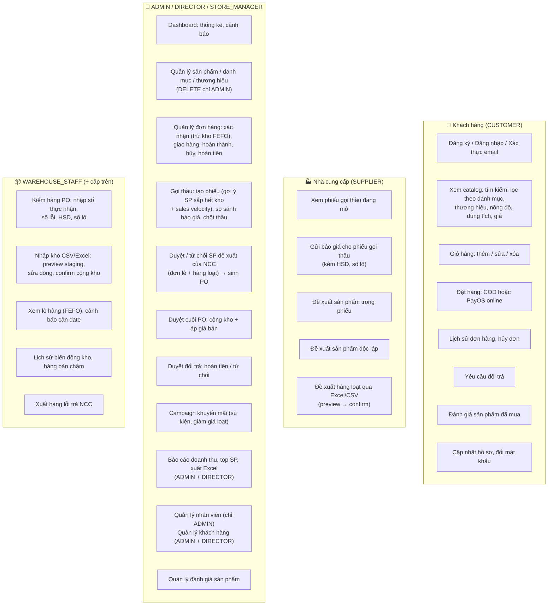

---

## 4. Luồng đặt hàng & thanh toán

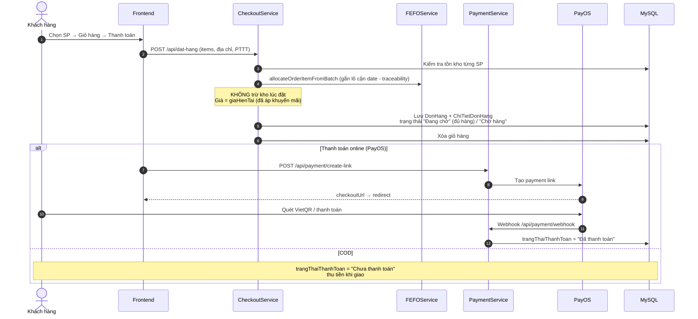

---

## 5. Luồng admin xác nhận đơn - trừ kho FEFO multi-batch

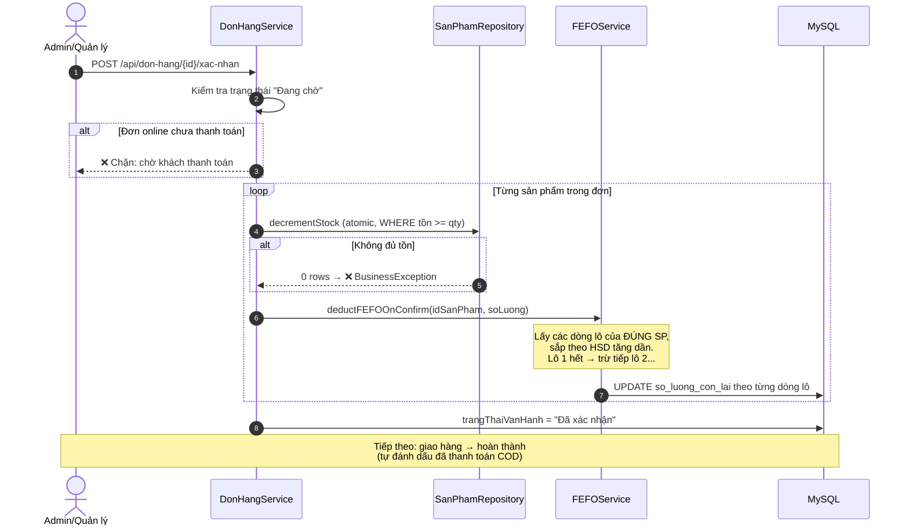

---

## 6. Luồng NCC chào hàng → Admin duyệt → Kho kiểm → Cộng kho

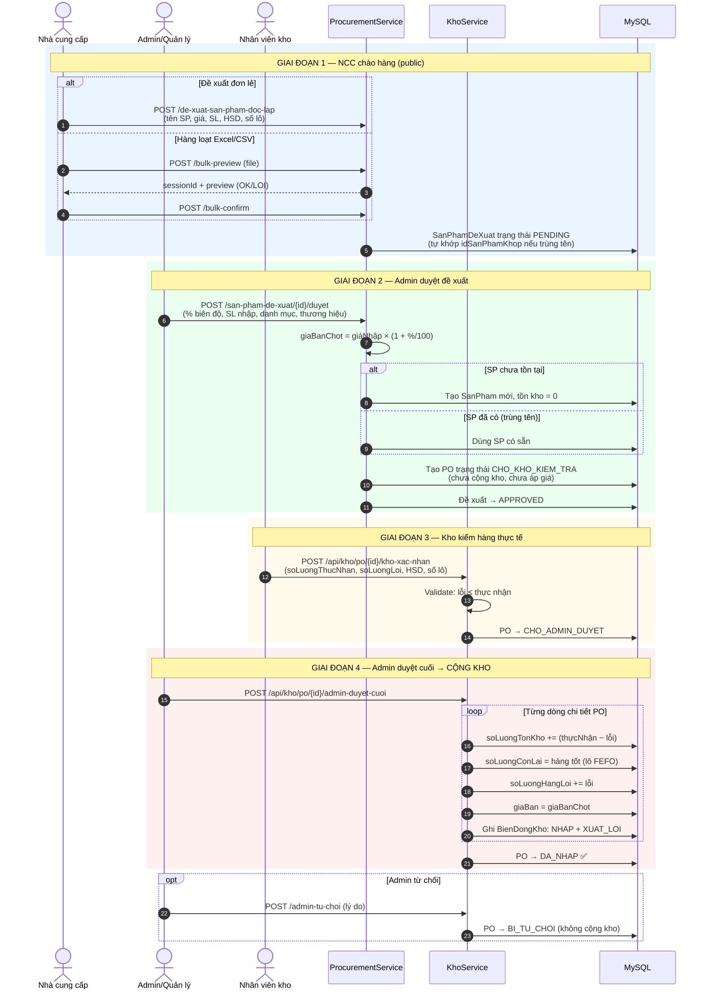

---

## 7. Luồng gọi thầu cạnh tranh

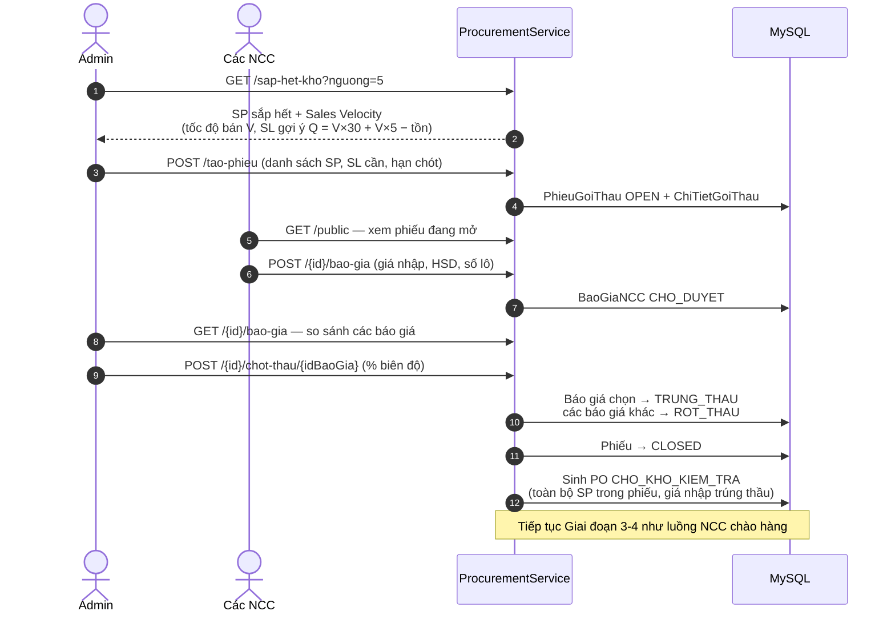

---

## 8. Luồng nhập kho thủ công qua CSV/Excel

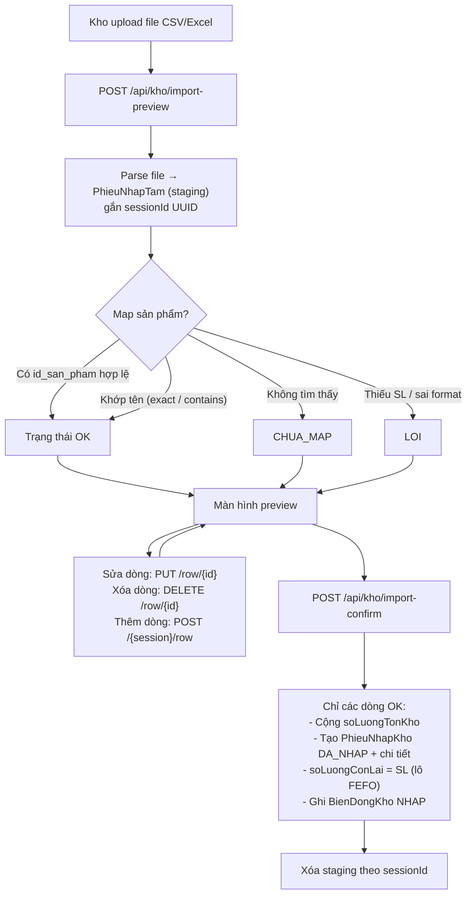

---

## 9. Luồng đổi trả & hoàn tiền

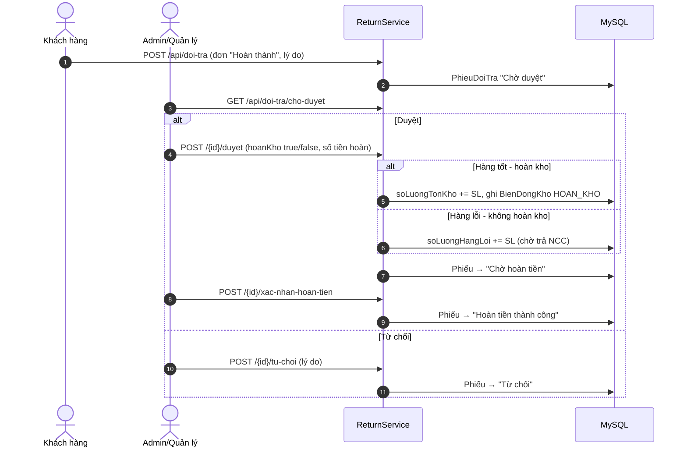

---

## 10. Trạng thái đơn hàng

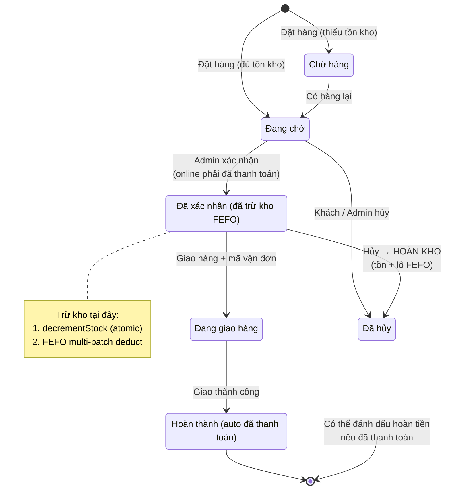

### Trạng thái thanh toán

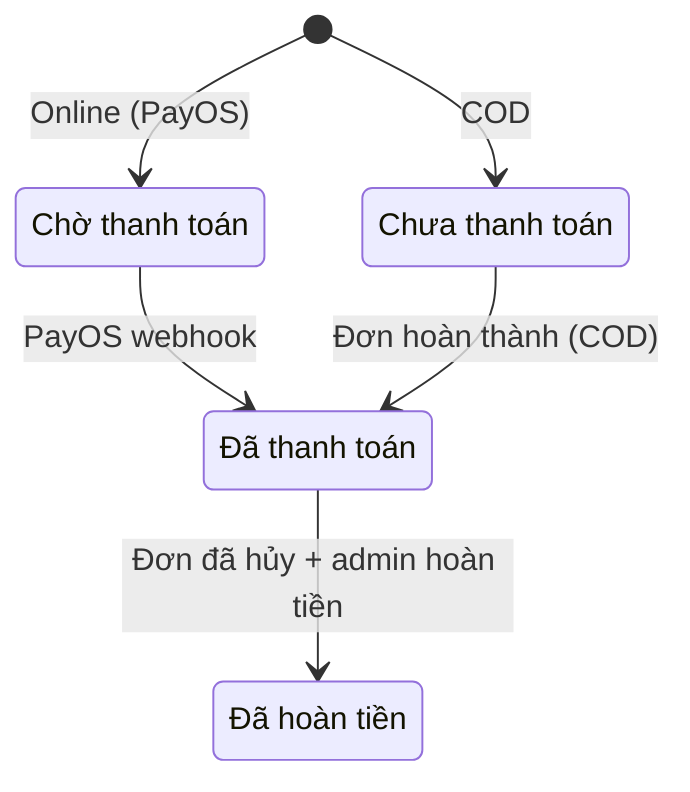

---

## 11. Trạng thái phiếu nhập kho (PO)

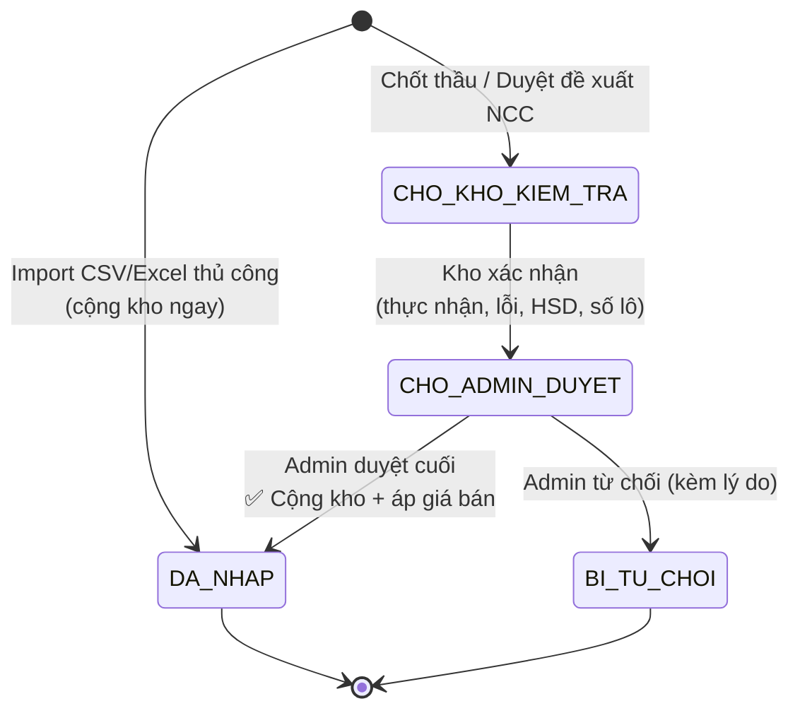

---

## 12. Trạng thái gọi thầu / báo giá / đề xuất / đổi trả

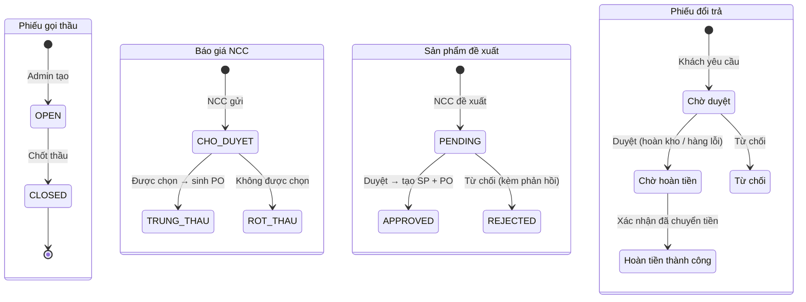

---

## 13. Phân quyền hệ thống (RBAC)

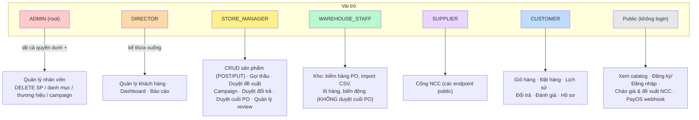

---

## 14. Cảnh báo & phân tích kho (FEFO / Sales Velocity)

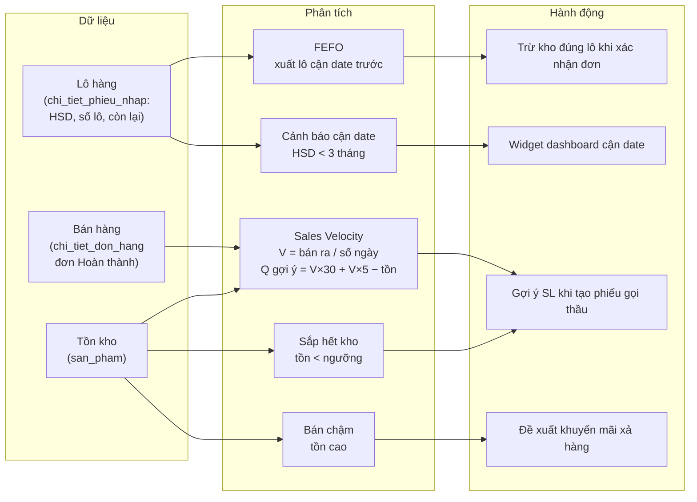
