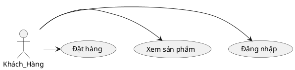

# HƯỚNG DẪN VẼ CÁC SƠ ĐỒ CHO LUẬN VĂN

Tài liệu này hướng dẫn cách tạo các sơ đồ chuyên nghiệp cho luận văn sử dụng PlantUML và Mermaid.

---

## 🎨 Công cụ khuyên dùng

### 1. **PlantUML** (Khuyên dùng cho Use Case, Sequence, Class Diagram)
- Website: https://plantuml.com/
- VS Code Extension: "PlantUML"
- Online Editor: http://www.plantuml.com/plantuml/

### 2. **Mermaid** (Khuyên dùng cho Flowchart, ERD)
- Website: https://mermaid.js.org/
- VS Code Extension: "Markdown Preview Mermaid Support"
- Online Editor: https://mermaid.live/

### 3. **Draw.io (diagrams.net)** (Cho kiến trúc tổng quan)
- Website: https://app.diagrams.net/
- Desktop App: Có sẵn
- Integration: Có thể embed vào VSCode

### 4. **MySQL Workbench** (Cho ERD từ database)
- Tự động generate ERD từ database schema
- Export sang PNG/SVG

---

## 📊 Các loại sơ đồ cần vẽ

### 1. Use Case Diagram (Sơ đồ tình huống sử dụng)
### 2. ERD - Entity Relationship Diagram (Sơ đồ quan hệ thực thể)
### 3. Sequence Diagram (Sơ đồ tuần tự)
### 4. Class Diagram (Sơ đồ lớp)
### 5. Activity Diagram (Sơ đồ hoạt động)
### 6. System Architecture Diagram (Sơ đồ kiến trúc hệ thống)
### 7. Deployment Diagram (Sơ đồ triển khai)

---

## 📁 Cấu trúc thư mục sơ đồ

```
LuanVanTotNghiep_BaoCao/
└── diagrams/
    ├── plantuml/           # File .puml (source)
    ├── mermaid/            # File .mmd (source)
    ├── generated/          # Ảnh PNG/SVG đã generate
    │   ├── use-cases/
    │   ├── erd/
    │   ├── sequence/
    │   ├── class/
    │   ├── activity/
    │   ├── architecture/
    │   └── deployment/
    └── README.md
```

---

## 🚀 Bắt đầu nhanh

### Bước 1: Cài đặt công cụ

#### Cho PlantUML:
```bash
# Cài Java (required)
# Download từ: https://www.java.com/

# Cài VS Code Extension
# Tìm "PlantUML" trong Extensions marketplace
```

#### Cho Mermaid:
```bash
# Cài VS Code Extension
# Tìm "Markdown Preview Mermaid Support"

# Hoặc dùng CLI
npm install -g @mermaid-js/mermaid-cli
```

### Bước 2: Tạo sơ đồ đầu tiên

Tạo file `test.puml`:


Xem kết quả: Click chuột phải → "Preview Current Diagram"

### Bước 3: Export sang ảnh

#### PlantUML:
```bash
# Cách 1: Trong VS Code
# Right-click → Export Current Diagram → PNG

# Cách 2: Command line
java -jar plantuml.jar diagram.puml
```

#### Mermaid:
```bash
# Command line
mmdc -i diagram.mmd -o diagram.png
```

---

## 📖 Chi tiết từng loại sơ đồ

Xem các file hướng dẫn chi tiết:
- `SO_DO_USE_CASE.md` - Use Case Diagrams
- `SO_DO_ERD.md` - Entity Relationship Diagrams  
- `SO_DO_SEQUENCE.md` - Sequence Diagrams
- `SO_DO_CLASS.md` - Class Diagrams
- `SO_DO_ACTIVITY.md` - Activity Diagrams
- `SO_DO_ARCHITECTURE.md` - Architecture Diagrams
- `SO_DO_DEPLOYMENT.md` - Deployment Diagrams

---

## 💡 Tips & Best Practices

### 1. Đặt tên file

```
Format: <loại>_<mô-tả>_<phiên-bản>.puml

Ví dụ:
- usecase_khach_hang_v1.puml
- erd_full_database_v2.puml
- sequence_dat_hang_v1.puml
- class_domain_model_v1.puml
```

### 2. Quản lý phiên bản

- Commit file source (.puml, .mmd) vào Git
- Không commit ảnh PNG nếu có thể generate lại
- Tag version quan trọng

### 3. Styling

- Sử dụng màu sắc nhất quán
- Font chữ rõ ràng (Arial, Tahoma)
- Kích thước phù hợp (A4: 800-1200px width)
- Export ở độ phân giải cao (300 DPI)

### 4. Documentation

- Thêm comment trong file source
- Giải thích các ký hiệu đặc biệt
- Ghi chú phiên bản và ngày cập nhật

---

## 🔧 Troubleshooting

### PlantUML không preview được?
```bash
# Kiểm tra Java
java -version

# Cài đặt Graphviz (required cho một số diagram)
# Windows: choco install graphviz
# Mac: brew install graphviz
# Linux: sudo apt install graphviz
```

### Ảnh export bị mờ?
```plantuml
@startuml
skinparam dpi 300
' Nội dung sơ đồ
@enduml
```

### Font tiếng Việt bị lỗi?
```plantuml
@startuml
skinparam defaultFontName Arial Unicode MS
' Hoặc
skinparam defaultFontName "Times New Roman"
@enduml
```

---

## 📚 Tài liệu tham khảo

### PlantUML
- Official Guide: https://plantuml.com/guide
- Cheat Sheet: https://plantuml.com/commons
- Examples: https://real-world-plantuml.com/

### Mermaid
- Official Docs: https://mermaid.js.org/intro/
- Live Editor: https://mermaid.live/
- Syntax: https://mermaid.js.org/intro/syntax-reference.html

### UML General
- UML Distilled (Martin Fowler)
- https://www.uml-diagrams.org/
- https://www.visual-paradigm.com/guide/uml-unified-modeling-language/

---

## 🎯 Checklist cho luận văn

- [ ] Use Case Diagram tổng quan (6 actors)
- [ ] Use Case Diagrams chi tiết (từng actor)
- [ ] ERD đầy đủ (25+ bảng)
- [ ] Sequence Diagrams (5-7 quy trình chính)
- [ ] Class Diagram (Domain Model)
- [ ] Activity Diagrams (3-4 quy trình phức tạp)
- [ ] System Architecture Diagram
- [ ] Deployment Diagram
- [ ] Component Diagram (optional)
- [ ] State Diagram cho Order (optional)

---

## ✨ Template project

Tôi đã tạo sẵn các file template trong thư mục `diagrams/`.  
Bạn chỉ cần:
1. Copy file template
2. Sửa nội dung theo hệ thống của bạn
3. Generate ảnh
4. Chèn vào báo cáo

**Happy Diagramming!** 🎨📊