# TRƯỜNG ĐẠI HỌC CÔNG NGHỆ SÀI GÒN
## KHOA CÔNG NGHỆ THÔNG TIN
### ---oOo---

# LUẬN VĂN TỐT NGHIỆP

**Tên đề tài:**

# XÂY DỰNG HỆ THỐNG BÁN NƯỚC HOA TRỰC TUYẾN ENSTORM PERFUME

---

**Sinh viên thực hiện:** [Tên sinh viên]

**Người hướng dẫn:** [Tên giáo viên hướng dẫn]

**TP. HỒ CHÍ MINH – NĂM 2026**

---

# LỜI CẢM ƠN

Trong suốt quá trình thực hiện luận văn tốt nghiệp, em đã nhận được sự hỗ trợ và giúp đỡ quý báu từ nhiều phía. Em xin gửi lời cảm ơn chân thành đến:

Quý thầy/cô Khoa Công nghệ Thông tin – Trường Đại học Công nghệ Sài Gòn đã tận tình truyền đạt kiến thức trong suốt quá trình học tập.

Thầy/cô giáo viên hướng dẫn đã dành thời gian định hướng, góp ý và hỗ trợ em hoàn thành đề tài này.

Gia đình và bạn bè đã luôn động viên, tạo điều kiện tốt nhất để em hoàn thành luận văn.

Do kiến thức và kinh nghiệm còn hạn chế, luận văn không tránh khỏi những thiếu sót. Em rất mong nhận được sự góp ý của quý thầy/cô để hoàn thiện hơn.

*TP. Hồ Chí Minh, năm 2026*

*Sinh viên thực hiện*

---

# MỤC LỤC

- Chương 1. GIỚI THIỆU
  - 1.1 Đặt vấn đề
  - 1.2 Những thách thức cần giải quyết
  - 1.3 Nội dung, phạm vi thực hiện
  - 1.4 Kết quả cần đạt
- Chương 2. PHƯƠNG PHÁP THỰC HIỆN
  - 2.1 Các hệ thống tương tự
  - 2.2 Công nghệ sử dụng
  - 2.3 Phân tích yêu cầu
    - 2.3.1 Các quy trình nghiệp vụ
    - 2.3.2 Sơ đồ chức năng
    - 2.3.3 Sơ đồ Use case tổng quát
- Chương 3. THIẾT KẾ
  - 3.1 Mô hình dữ liệu
  - 3.2 Mô hình xử lý
    - 3.2.1 Use case chi tiết
    - 3.2.2 Sơ đồ tuần tự
    - 3.2.3 Sơ đồ hoạt động
  - 3.3 Hệ thống màn hình
  - 3.4 Hệ thống báo biểu
- Chương 4. THỬ NGHIỆM
  - 4.1 Các kịch bản thử nghiệm
  - 4.2 Kết quả thử nghiệm
  - 4.3 Xử lý trường hợp ngoại lệ
- Chương 5. KẾT LUẬN
  - 5.1 Kết quả đối chiếu với mục tiêu
  - 5.2 Các vấn đề còn tồn đọng
  - 5.3 Mở rộng
- Phụ lục: Hướng dẫn sử dụng
- Tài liệu tham khảo

---

# MỤC LỤC CÁC HÌNH VẼ

- Hình 2-1. Sơ đồ chức năng hệ thống
- Hình 2-2. Sơ đồ Use case tổng quát
- Hình 3-1. Sơ đồ ERD (Entity Relationship Diagram)
- Hình 3-2. Sơ đồ tuần tự – Quy trình đặt hàng
- Hình 3-3. Sơ đồ tuần tự – Quy trình thanh toán PayOS
- Hình 3-4. Sơ đồ tuần tự – Quy trình đấu thầu NCC
- Hình 3-5. Sơ đồ tuần tự – Quy trình nhập kho PO
- Hình 3-6. Sơ đồ tuần tự – Quy trình đổi trả
- Hình 3-7. Sơ đồ hoạt động – Quy trình đặt hàng và xử lý đơn
- Hình 3-8. Sơ đồ hoạt động – Quy trình đấu thầu
- Hình 3-9. Sơ đồ hoạt động – Quy trình nhập kho
- Hình 3-10. Sơ đồ hoạt động – Quy trình đổi trả

---

# Chương 1. GIỚI THIỆU

## 1.1 Đặt vấn đề

Trong bối cảnh thương mại điện tử phát triển mạnh mẽ tại Việt Nam, ngành bán lẻ nước hoa đang đối mặt với nhu cầu chuyển đổi số ngày càng cấp thiết. Các cửa hàng nước hoa truyền thống gặp nhiều khó khăn trong việc quản lý hàng tồn kho, xử lý đơn hàng đa kênh, kiểm soát chất lượng hàng nhập khẩu (đặc biệt về hạn sử dụng lô hàng), và thiết lập mối quan hệ minh bạch với nhà cung cấp.

Nhu cầu thực tế đặt ra:
- Khách hàng muốn mua sắm trực tuyến 24/7, thanh toán linh hoạt (COD hoặc chuyển khoản online)
- Doanh nghiệp cần kiểm soát tồn kho chính xác theo lô hàng và hạn sử dụng (FEFO)
- Quy trình nhập hàng từ nhiều nhà cung cấp cần đấu thầu cạnh tranh, minh bạch
- Ban lãnh đạo cần báo cáo doanh thu, giám sát hoạt động theo thời gian thực

Xuất phát từ những vấn đề trên, đề tài **"Xây dựng Hệ thống Bán Nước Hoa Trực Tuyến Enstorm Perfume"** được thực hiện nhằm xây dựng một nền tảng thương mại điện tử toàn diện tích hợp quản trị nội bộ.

## 1.2 Những thách thức cần giải quyết

**Về mặt kỹ thuật:**
- Thiết kế hệ thống phân quyền RBAC (Role-Based Access Control) đa cấp với 6 vai trò khác nhau
- Tích hợp cổng thanh toán PayOS với xử lý webhook bất đồng bộ
- Cài đặt thuật toán FEFO (First Expired First Out) cho quản lý lô hàng
- Xây dựng quy trình đấu thầu nhiều bước có trạng thái phức tạp
- Đảm bảo tính nhất quán dữ liệu tồn kho trong môi trường đồng thời

**Về mặt nghiệp vụ:**
- Mô hình hóa quy trình đổi trả hàng phức tạp (không hoàn kho thông thường, chuyển sang hàng lỗi)
- Thiết kế cổng chào hàng cho NCC không cần tài khoản (public endpoint)
- Tích hợp chiến dịch khuyến mại tự động cập nhật giao diện trang chủ
- Xây dựng tính năng xác nhận đơn hàng qua QR không yêu cầu đăng nhập

## 1.3 Nội dung, phạm vi thực hiện

**Phạm vi thực hiện:**

Hệ thống gồm hai thành phần chính:
1. **Website bán hàng (B2C):** Khách hàng duyệt sản phẩm, đặt hàng, thanh toán, theo dõi đơn hàng, đánh giá sản phẩm
2. **Hệ thống quản trị nội bộ (CMS):** Nhân viên quản lý sản phẩm, đơn hàng, kho hàng, đấu thầu, báo cáo

**Ngoài phạm vi:**
- Ứng dụng di động (mobile app)
- Tích hợp đơn vị vận chuyển bên thứ ba (chỉ quản lý mã vận đơn thủ công)
- Hệ thống kế toán chuyên nghiệp

## 1.4 Kết quả cần đạt

| STT | Kết quả cần đạt | Tiêu chí đánh giá | Loại |
|---|---|---|---|
| 1 | Module đăng ký/đăng nhập có xác thực email | Tài khoản chưa xác thực không thể đăng nhập | Chức năng |
| 2 | Phân quyền 6 vai trò | Mỗi vai trò chỉ truy cập đúng chức năng được phép | Chức năng |
| 3 | Đặt hàng và thanh toán COD/PayOS | Đơn được tạo thành công, PayOS redirect và webhook xử lý đúng | Chức năng |
| 4 | Xác nhận đơn hàng qua QR | QR hoạt động không cần đăng nhập, bill hiển thị đúng | Chức năng |
| 5 | Quản lý kho FEFO theo lô hàng | Xuất đúng lô có HSD sớm nhất, cảnh báo lô cận hết hạn | Chức năng |
| 6 | Quy trình đấu thầu NCC 4 bước | Tạo phiếu → NCC báo giá → Chốt thầu → Sinh PO → Kho kiểm → Admin duyệt | Chức năng |
| 7 | Quy trình đổi trả hàng 3 bước | Khách tạo → Admin duyệt → Xác nhận hoàn tiền | Chức năng |
| 8 | Chiến dịch khuyến mại tự động | Banner và sản phẩm trang chủ tự cập nhật | Chức năng |
| 9 | Báo cáo doanh thu xuất CSV | Báo cáo đúng số liệu, xuất file CSV thành công | Chức năng |
| 10 | Log đăng nhập giám sát | Ghi đầy đủ IP, user-agent, trạng thái, lọc được theo nhiều tiêu chí | Chức năng |
| 11 | Bảo mật JWT stateless | Token hết hạn tự redirect login, phân quyền backend chặn đúng | Phi chức năng |
| 12 | Hiệu năng tải trang | Trang danh sách sản phẩm tải < 2 giây | Phi chức năng |
| 13 | Giao diện responsive | Hiển thị đúng trên màn hình 375px đến 1920px | Phi chức năng |

---

# Chương 2. PHƯƠNG PHÁP THỰC HIỆN

## 2.1 Các hệ thống tương tự

### 2.1.1 Shopee / Lazada (Sàn TMĐT đa ngành)

**Ưu điểm:** Hệ sinh thái hoàn chỉnh, tích hợp logistics, lượng người dùng lớn, thanh toán đa dạng.

**Nhược điểm:** Không có module quản lý kho theo lô hàng và hạn sử dụng chuyên biệt cho ngành nước hoa; không có quy trình đấu thầu nhà cung cấp; phí hoa hồng cao; không kiểm soát được hàng giả, hàng kém chất lượng.

### 2.1.2 Nhanh.vn / KiotViet (Phần mềm quản lý bán lẻ)

**Ưu điểm:** Quản lý kho tốt, hỗ trợ nhiều chi nhánh, tích hợp POS.

**Nhược điểm:** Không có cổng thương mại điện tử B2C tích hợp; không có quy trình đấu thầu NCC; không hỗ trợ quản lý lô hàng theo FEFO; chi phí bản quyền cao theo tháng.

### 2.1.3 WooCommerce + WordPress (Nền tảng mã nguồn mở)

**Ưu điểm:** Linh hoạt, nhiều plugin, miễn phí cơ bản.

**Nhược điểm:** Cần nhiều plugin bên thứ ba gây xung đột; không có quy trình nghiệp vụ đặc thù cho nước hoa (FEFO, đấu thầu); bảo mật phụ thuộc nhiều vào plugin.

### 2.1.4 Nhận xét và hướng giải quyết

Hệ thống đề xuất kế thừa điểm mạnh của các giải pháp trên và bổ sung:
- Quản lý lô hàng FEFO chuyên biệt cho sản phẩm có hạn sử dụng
- Quy trình đấu thầu NCC tích hợp trong cùng hệ thống
- Phân quyền chi tiết theo nghiệp vụ thực tế của cửa hàng nước hoa
- Xác nhận đơn hàng qua QR code không cần đăng nhập

## 2.2 Công nghệ sử dụng

### 2.2.1 Backend – Spring Boot 3 (Java 17)

Spring Boot là framework Java phổ biến cho xây dựng REST API. Phiên bản 3 hỗ trợ Jakarta EE 10, Spring Security 6 với cấu hình đơn giản hơn. Được chọn vì tính ổn định, hệ sinh thái phong phú (JPA, Security, Mail), và phù hợp với hệ thống có nghiệp vụ phức tạp.

### 2.2.2 Frontend – React.js 18 + Tailwind CSS

React.js cho phép xây dựng giao diện người dùng dạng SPA (Single Page Application) với hiệu năng cao nhờ Virtual DOM. Tailwind CSS cung cấp utility-first CSS giúp phát triển giao diện nhanh và nhất quán.

### 2.2.3 Cơ sở dữ liệu – MySQL 8

MySQL là hệ quản trị CSDL quan hệ phổ biến, ổn định, hỗ trợ tốt các tính năng transaction ACID cần thiết cho nghiệp vụ quản lý tồn kho.

### 2.2.4 Bảo mật – JWT (JSON Web Token)

JWT được dùng để xác thực stateless, phù hợp với kiến trúc REST API. Token chứa thông tin vai trò người dùng, được ký bằng HMAC-SHA256.

### 2.2.5 Thanh toán – PayOS

PayOS là cổng thanh toán Việt Nam hỗ trợ thanh toán qua QR VietQR, liên kết ngân hàng. Tích hợp webhook để cập nhật trạng thái thanh toán bất đồng bộ.

### 2.2.6 Email – JavaMail + SMTP Gmail

Dùng để gửi email xác thực tài khoản, thông báo thanh toán thành công, thông báo hủy đơn hàng.

### 2.2.7 Xuất dữ liệu – Apache POI + Apache Commons CSV

Apache POI xử lý file Excel (.xlsx/.xls), Apache Commons CSV xử lý file CSV. Dùng cho tính năng import nhập kho và đề xuất sản phẩm hàng loạt từ NCC.

## 2.3 Phân tích yêu cầu

### 2.3.1 Các quy trình nghiệp vụ

#### 2.3.1.1 Quy trình đăng ký và xác thực tài khoản

Khách hàng điền form đăng ký (tên đăng nhập, mật khẩu, họ tên, email). Hệ thống tạo tài khoản với trạng thái chưa xác thực và gửi email kèm link xác thực có token (thời hạn 24 giờ). Khách nhấn link, hệ thống kiểm tra token hợp lệ, kích hoạt tài khoản. Nếu token hết hạn, khách có thể yêu cầu gửi lại email.

#### 2.3.1.2 Quy trình mua hàng và thanh toán

Khách duyệt sản phẩm → thêm vào giỏ → checkout (điền địa chỉ, chọn phương thức thanh toán). Nếu chọn COD: đơn tạo ngay, trạng thái "Đang chờ xác nhận". Nếu chọn PayOS: hệ thống tạo link thanh toán, redirect khách sang PayOS. Sau khi thanh toán, PayOS gửi webhook cập nhật trạng thái. Kho chỉ bị trừ khi admin xác nhận đơn (không trừ kho tại thời điểm đặt).

#### 2.3.1.3 Quy trình xử lý đơn hàng

Admin xem danh sách đơn → xác nhận đơn (trừ kho FEFO) → chuyển trạng thái giao hàng → cập nhật mã vận đơn. Khách quét QR hoặc vào web xác nhận đã nhận hàng → đơn hoàn thành.

#### 2.3.1.4 Quy trình đổi trả hàng

Khách tạo yêu cầu (qua web hoặc QR) → Admin duyệt: toàn bộ sản phẩm chuyển sang "hàng lỗi" (soLuongHangLoi), đơn chuyển "Chờ hoàn tiền" → Admin xác nhận đã hoàn tiền → đơn "Đã hoàn trả". Hàng lỗi được theo dõi riêng, khi đủ số lượng admin xuất trả NCC.

#### 2.3.1.5 Quy trình đấu thầu và nhập kho

Admin tạo phiếu gọi thầu (chọn sản phẩm cần nhập từ danh sách sắp hết kho, hệ thống gợi ý số lượng theo sales velocity) → NCC xem phiếu công khai, gửi báo giá → Admin so sánh, chốt thầu (thiết lập % biên lợi nhuận) → Hệ thống tự sinh PO trạng thái "Chờ kho kiểm tra" → Nhân viên kho kiểm hàng thực tế (số lượng, HSD, số lô, ảnh) → Cửa hàng trưởng duyệt cuối → Kho cộng tồn, giá bán cập nhật.

#### 2.3.1.6 Quy trình NCC đề xuất sản phẩm độc lập

NCC vào cổng `/supplier-portal` (không cần đăng nhập hoặc dùng tài khoản SUPPLIER) → Đề xuất sản phẩm đơn lẻ (form) hoặc hàng loạt (upload Excel/CSV với preview validate) → Admin xem theo nhóm NCC → Duyệt từng sản phẩm (thiết lập % biên lợi nhuận, gán danh mục/thương hiệu) hoặc duyệt hàng loạt → Hệ thống tạo sản phẩm mới + PO vào luồng kiểm kho.

#### 2.3.1.7 Quy trình quản lý chiến dịch khuyến mại

Admin tạo chiến dịch (tên, banner URL, thời gian, % giảm giá) → Gán sản phẩm vào chiến dịch → Bật chiến dịch. Trang chủ tự động hiển thị banner và sản phẩm của chiến dịch đang hoạt động. Khi đặt hàng trong chiến dịch, % giảm áp dụng vào tổng tiền.

### 2.3.2 Sơ đồ chức năng

**Hình 2-1: Sơ đồ chức năng hệ thống**

```mermaid
graph TD
    A[Hệ thống Enstorm Perfume] --> B[Khách hàng]
    A --> C[Nhân viên nội bộ]
    A --> D[Nhà cung cấp - NCC]

    B --> B1[Đăng ký / Đăng nhập]
    B --> B2[Duyệt & tìm kiếm sản phẩm]
    B --> B3[Quản lý giỏ hàng]
    B --> B4[Đặt hàng - COD hoặc PayOS]
    B --> B5[Xem lịch sử đơn hàng]
    B --> B6[Xác nhận nhận hàng qua QR - không cần login]
    B --> B7[Yêu cầu đổi trả]
    B --> B8[Đánh giá sản phẩm]
    B --> B9[Cập nhật hồ sơ cá nhân]

    C --> C1[ADMIN Root]
    C --> C2[DIRECTOR - Giám đốc]
    C --> C3[STORE_MANAGER - Cửa hàng trưởng]
    C --> C4[WAREHOUSE_STAFF - Nhân viên kho]

    %% ADMIN Root - chỉ quyền riêng, không kế thừa trong sơ đồ này
    C1 --> C1a[Quản lý tài khoản nhân viên CRUD]
    C1 --> C1b[Xóa sản phẩm / danh mục / thương hiệu / campaign]
    C1 --> C1c[Xem và lọc log đăng nhập]
    C1 --> C1d[Quản lý tài khoản khách hàng]
    C1 --> C1e[Xem Dashboard tổng quan]
    C1 --> C1f[Xem báo cáo doanh thu - xuất CSV]
    C1 --> C1g[Toàn bộ quyền quản lý vận hành]

    %% DIRECTOR - quyền riêng
    C2 --> C2a[Xem báo cáo doanh thu - xuất CSV]
    C2 --> C2b[Xem và lọc log đăng nhập]
    C2 --> C2c[Xem Dashboard tổng quan]
    C2 --> C2d[Quản lý tài khoản khách hàng]
    C2 --> C2e[Toàn bộ quyền quản lý vận hành]

    %% STORE_MANAGER - quyền vận hành
    C3 --> C3a[Thêm/sửa sản phẩm - danh mục - thương hiệu]
    C3 --> C3b[Xác nhận và xử lý đơn hàng]
    C3 --> C3c[Duyệt đổi trả và xác nhận hoàn tiền]
    C3 --> C3d[Tạo phiếu gọi thầu - chốt thầu NCC]
    C3 --> C3e[Duyệt đề xuất sản phẩm từ NCC]
    C3 --> C3f[Quản lý chiến dịch khuyến mại]
    C3 --> C3g[Quản lý đánh giá sản phẩm]
    C3 --> C3h[Duyệt cuối PO sau khi kho kiểm]
    C3 --> C3i[Xem tất cả chức năng kho]

    %% WAREHOUSE_STAFF - quyền kho
    C4 --> C4a[Import phiếu nhập kho CSV/Excel]
    C4 --> C4b[Kiểm tra hàng PO từ đấu thầu - điền số lượng thực/HSD/số lô]
    C4 --> C4c[Xem lịch sử biến động kho]
    C4 --> C4d[Xem cảnh báo lô hàng cận hết hạn]
    C4 --> C4e[Xem và quản lý lô hàng theo FEFO]
    C4 --> C4f[Xem danh sách sản phẩm bán chậm]
    C4 --> C4g[Xem danh sách sản phẩm gần hết kho]

    %% NCC - hai nhóm endpoint
    D --> D1[PUBLIC - Xem phiếu gọi thầu đang mở]
    D --> D2[PUBLIC - Gửi báo giá cho phiếu gọi thầu]
    D --> D3[PUBLIC - Đề xuất sản phẩm đơn lẻ form]
    D --> D4[PUBLIC - Upload đề xuất hàng loạt Excel/CSV]
    D --> D5[SUPPLIER login - Supplier Portal xem trạng thái đề xuất]
```

### 2.3.3 Sơ đồ Use case tổng quát

**Mô tả các Actor:**

| Actor | Mô tả | Quyền đặc trưng |
|---|---|---|
| Khách hàng (CUSTOMER) | Người dùng cuối mua sắm qua website | Đặt hàng, đổi trả, đánh giá |
| Admin Root (ADMIN) | Quản trị viên hệ thống, quyền cao nhất | CRUD nhân viên, xóa dữ liệu, tất cả quyền bên dưới |
| Giám đốc (DIRECTOR) | Giám sát tổng quan, xem báo cáo | Báo cáo, log đăng nhập, dashboard, quản lý KH, tất cả quyền vận hành |
| Cửa hàng trưởng (STORE_MANAGER) | Quản lý vận hành hàng ngày | Đơn hàng, sản phẩm, đấu thầu, chiến dịch, duyệt PO cuối |
| Nhân viên kho (WAREHOUSE_STAFF) | Quản lý nhập xuất kho | Kiểm hàng PO, import kho, lô hàng FEFO, cảnh báo HSD |
| NCC không login (public) | Nhà cung cấp chưa có tài khoản | Xem thầu công khai, gửi báo giá, đề xuất SP qua form/CSV |
| NCC đã login (SUPPLIER) | Nhà cung cấp có tài khoản trong hệ thống | Tất cả quyền public + thông tin NCC tự động điền trong portal |

**Hình 2-2: Sơ đồ Use case tổng quát**

```mermaid
graph LR
    KH(Khách hàng) --> UC1[Đăng ký tài khoản]
    KH --> UC2[Đăng nhập]
    KH --> UC3[Duyệt & tìm kiếm sản phẩm]
    KH --> UC4[Quản lý giỏ hàng]
    KH --> UC5[Đặt hàng]
    KH --> UC6[Thanh toán PayOS]
    KH --> UC7[Xác nhận nhận hàng QR]
    KH --> UC8[Yêu cầu đổi trả]
    KH --> UC9[Đánh giá sản phẩm]
    KH --> UC10[Xem lịch sử đơn hàng]
    KH --> UC11[Cập nhật hồ sơ cá nhân]

    ADMIN(ADMIN Root) --> UC12[CRUD tài khoản nhân viên]
    ADMIN --> UC13[Phân quyền vai trò nhân viên]
    ADMIN --> UC14[Xóa sản phẩm/danh mục/thương hiệu/campaign]
    ADMIN --> UC_LOG[Xem log đăng nhập]
    ADMIN --> UC_KH[Quản lý tài khoản khách hàng - duyệt NCC]
    ADMIN --> UC_DASH[Xem Dashboard]
    ADMIN --> UC_RPT[Xem báo cáo - xuất CSV]
    ADMIN --> UC_OP[Toàn bộ quyền vận hành]

    GD(DIRECTOR) --> UC_LOG
    GD --> UC_KH
    GD --> UC_DASH
    GD --> UC_RPT
    GD --> UC_OP

    CTT(STORE_MANAGER) --> UC20[Thêm/sửa sản phẩm]
    CTT --> UC21[Quản lý danh mục/thương hiệu]
    CTT --> UC22[Xác nhận đơn hàng - trừ kho FEFO]
    CTT --> UC23[Chuyển trạng thái giao hàng]
    CTT --> UC24[Duyệt yêu cầu đổi trả]
    CTT --> UC25[Tạo phiếu gọi thầu]
    CTT --> UC26[Chốt thầu NCC]
    CTT --> UC27[Duyệt đề xuất sản phẩm NCC]
    CTT --> UC28[Quản lý chiến dịch]
    CTT --> UC29[Duyệt cuối PO sau kho kiểm - cộng kho]
    CTT --> UC_OP

    NVK(WAREHOUSE_STAFF) --> UC30[Import nhập kho CSV/Excel]
    NVK --> UC31[Kiểm tra PO đấu thầu - điền thực nhận/HSD/số lô]
    NVK --> UC32[Xem biến động kho]
    NVK --> UC33[Xem lô hàng FEFO]
    NVK --> UC34[Cảnh báo lô cận hết hạn]
    NVK --> UC35[Xem sản phẩm bán chậm]

    NCC_PUBLIC(NCC - Không login) --> UC36[Xem phiếu gọi thầu đang mở]
    NCC_PUBLIC --> UC37[Gửi báo giá cho phiếu gọi thầu]
    NCC_PUBLIC --> UC38[Đề xuất SP đơn lẻ qua form]
    NCC_PUBLIC --> UC39[Upload đề xuất hàng loạt Excel/CSV]

    NCC_LOGIN(NCC - SUPPLIER login) --> UC40[Supplier Portal - xem & gửi đề xuất với thông tin tự động điền]
    NCC_LOGIN --> UC36
    NCC_LOGIN --> UC37
    NCC_LOGIN --> UC38
    NCC_LOGIN --> UC39
```

---

# Chương 3. THIẾT KẾ

## 3.1 Mô hình dữ liệu

### 3.1.1 Mô hình ERD (Entity Relationship Diagram)

**Hình 3-1: Sơ đồ ERD hệ thống**

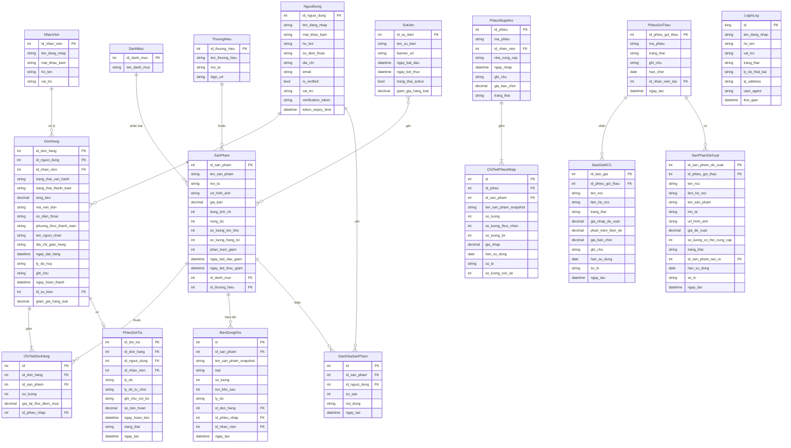

## 3.2 Mô hình xử lý

### 3.2.1 Use case chi tiết

#### UC-01: Đặt hàng

| Thành phần | Mô tả |
|---|---|
| **Tên use case** | Đặt hàng |
| **Actor** | Khách hàng (đã đăng nhập) |
| **Mô tả** | Khách hàng xác nhận giỏ hàng và tạo đơn hàng mới |
| **Điều kiện tiên quyết** | Đã đăng nhập, giỏ hàng có ít nhất 1 sản phẩm |
| **Luồng chính** | 1. Khách xem giỏ hàng → 2. Điền thông tin người nhận, địa chỉ → 3. Chọn phương thức thanh toán (COD/PayOS) → 4. Xác nhận đặt hàng → 5. Hệ thống kiểm tra tồn kho → 6. Tạo đơn hàng, sinh mã vận đơn → 7. Xóa giỏ hàng → 8. Hiển thị xác nhận đặt hàng |
| **Luồng thay thế** | 5a. Sản phẩm không đủ tồn kho → Đơn vào trạng thái "Chờ hàng"; 3b. Chọn PayOS → Redirect sang trang thanh toán PayOS |
| **Điều kiện hậu** | Đơn hàng được tạo với trạng thái "Đang chờ xác nhận", kho chưa bị trừ |

#### UC-02: Xác nhận đơn hàng (Admin)

| Thành phần | Mô tả |
|---|---|
| **Tên use case** | Xác nhận đơn hàng |
| **Actor** | Cửa hàng trưởng / Admin |
| **Mô tả** | Nhân viên xác nhận đơn hàng, kho bị trừ tại bước này |
| **Điều kiện tiên quyết** | Đơn ở trạng thái "Đang chờ"; đơn PayOS phải đã thanh toán |
| **Luồng chính** | 1. Admin xem danh sách đơn chờ → 2. Chọn đơn → 3. Bấm "Xác nhận" → 4. Hệ thống kiểm tra tồn kho từng sản phẩm → 5. Trừ kho theo FEFO → 6. Đơn chuyển "Đã xác nhận" |
| **Luồng thay thế** | 4a. Tồn kho không đủ → Hiển thị lỗi, không xác nhận được |
| **Điều kiện hậu** | Tồn kho bị trừ, đơn ở trạng thái "Đã xác nhận" |

#### UC-03: Chốt thầu NCC

| Thành phần | Mô tả |
|---|---|
| **Tên use case** | Chốt thầu nhà cung cấp |
| **Actor** | Cửa hàng trưởng / Admin |
| **Mô tả** | Admin chọn NCC trúng thầu từ danh sách báo giá |
| **Điều kiện tiên quyết** | Phiếu gọi thầu đang OPEN, có ít nhất 1 báo giá |
| **Luồng chính** | 1. Admin xem danh sách báo giá → 2. So sánh giá/điều kiện → 3. Chọn NCC trúng thầu → 4. Nhập % biên lợi nhuận → 5. Xác nhận chốt → 6. Hệ thống tính giá bán chốt → 7. Đóng phiếu gọi thầu → 8. Sinh PO CHO_KHO_KIEM_TRA |
| **Điều kiện hậu** | Phiếu gọi thầu CLOSED, PO được tạo, NCC trúng thầu đánh dấu TRUNG_THAU |

### 3.2.2 Sơ đồ tuần tự

**Hình 3-2: Sơ đồ tuần tự – Quy trình đặt hàng và thanh toán COD**

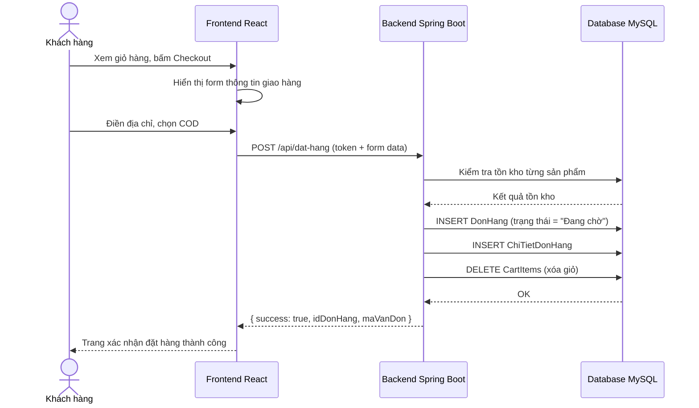

**Hình 3-3: Sơ đồ tuần tự – Quy trình thanh toán PayOS**

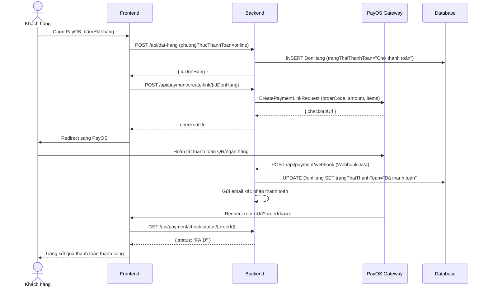

**Hình 3-4: Sơ đồ tuần tự – Quy trình đấu thầu NCC**

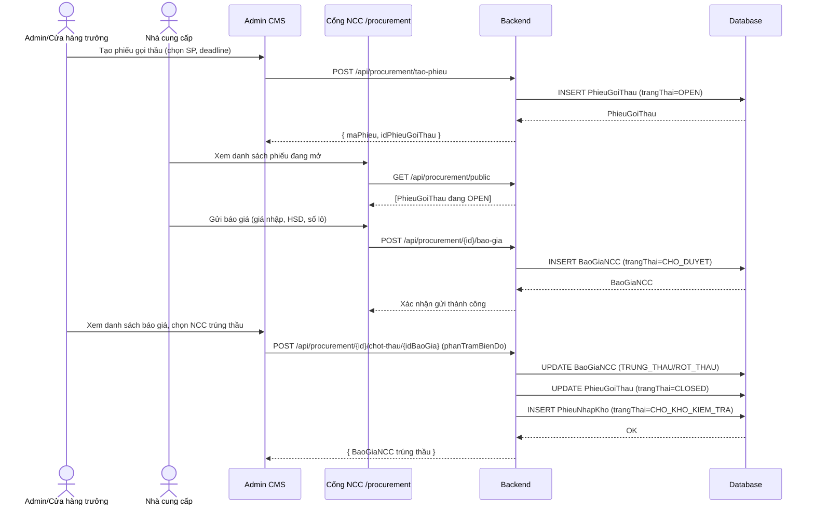

**Hình 3-5: Sơ đồ tuần tự – Quy trình kiểm kho và duyệt PO**

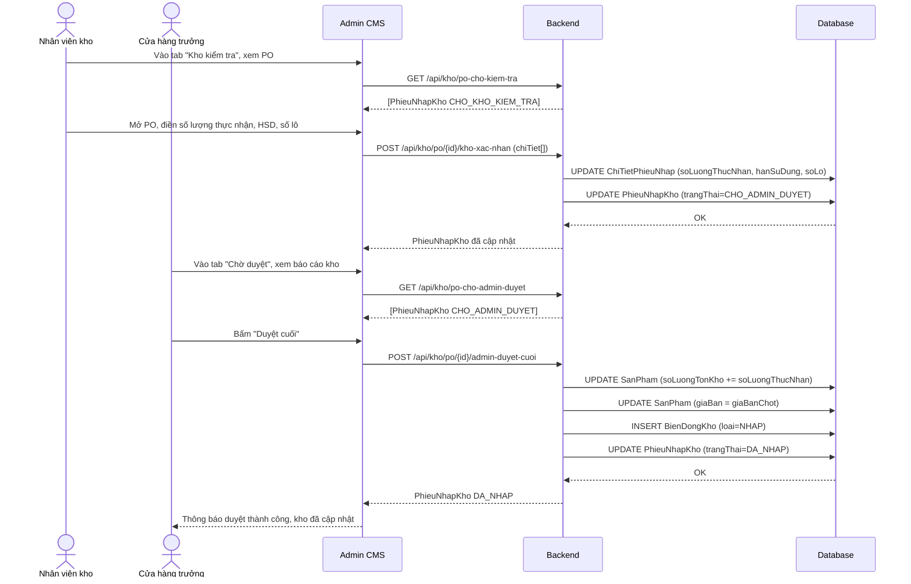

**Hình 3-6: Sơ đồ tuần tự – Quy trình đổi trả hàng**

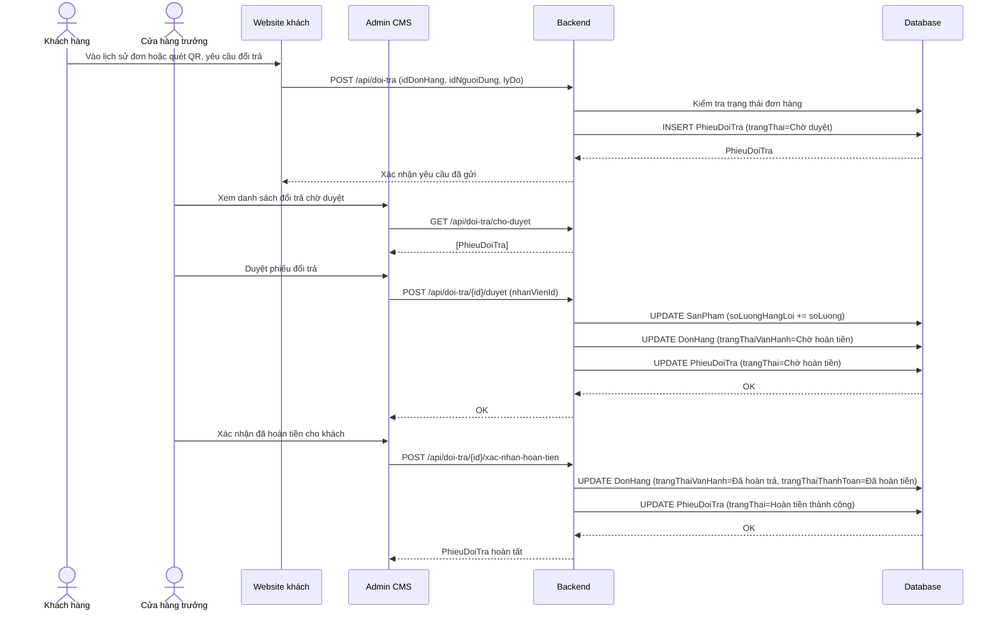

### 3.2.3 Sơ đồ hoạt động (Activity Diagram)

**Hình 3-7: Sơ đồ hoạt động – Quy trình đặt hàng và xử lý đơn**

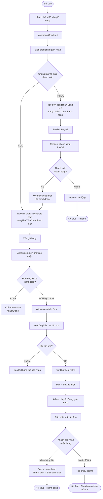

**Hình 3-8: Sơ đồ hoạt động – Quy trình đấu thầu NCC**

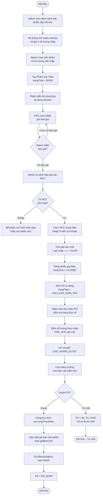

**Hình 3-9: Sơ đồ hoạt động – Quy trình nhập kho thủ công CSV/Excel**

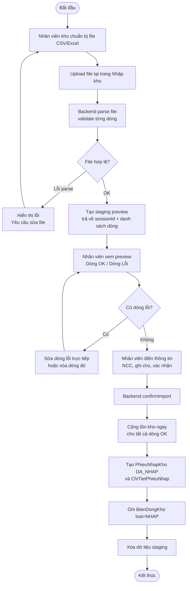

**Hình 3-10: Sơ đồ hoạt động – Quy trình đổi trả hàng**

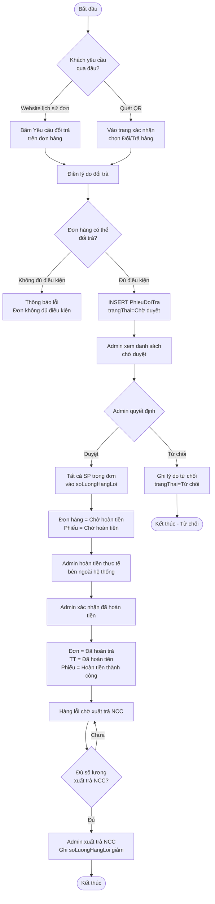

## 3.3 Hệ thống màn hình

### 3.3.1 Kiến trúc giao diện

Hệ thống gồm hai giao diện riêng biệt:

**Giao diện khách hàng (Public):** Trang chủ, danh mục sản phẩm, chi tiết sản phẩm, giỏ hàng, thanh toán, lịch sử đơn hàng, hồ sơ cá nhân, trang xác nhận QR.

**Giao diện quản trị (Admin CMS):** Dashboard, quản lý sản phẩm/danh mục/thương hiệu, quản lý đơn hàng, quản lý kho, đấu thầu, đổi trả, chiến dịch, báo cáo, tài khoản, log đăng nhập.

**Cổng NCC (Supplier Portal):** Trang chào hàng công khai, form đề xuất sản phẩm, upload Excel/CSV.

### 3.3.2 Mô tả các màn hình chính

| Màn hình | Mô tả | Phân quyền thực tế |
|---|---|---|
| Trang chủ | Banner chiến dịch động, sản phẩm nổi bật, danh mục | Public |
| Danh mục sản phẩm | Lọc theo danh mục/thương hiệu, tìm kiếm, sắp xếp | Public |
| Chi tiết sản phẩm + Đánh giá | Thông tin sản phẩm, đánh giá từ khách | Public |
| Giỏ hàng | Danh sách SP, số lượng, giảm giá chiến dịch | Đã đăng nhập (CUSTOMER) |
| Thanh toán | Form địa chỉ, chọn phương thức, xác nhận | Đã đăng nhập (CUSTOMER) |
| Lịch sử đơn hàng | Xem đơn, hủy đơn, yêu cầu đổi trả | Đã đăng nhập (CUSTOMER) |
| Xác nhận đơn QR | Bill receipt, xác nhận nhận hàng, form đổi trả | **Public (không cần login)** |
| Hồ sơ cá nhân | Thông tin cá nhân, đổi mật khẩu | Đã đăng nhập |
| Dashboard Admin | Thống kê, đơn gần đây, cảnh báo tồn kho/HSD | **ADMIN + DIRECTOR** |
| Quản lý đơn hàng | Danh sách, lọc, xem chi tiết, thao tác vận hành | **ADMIN + DIRECTOR + STORE_MANAGER** |
| Quản lý sản phẩm | Xem sản phẩm, lọc | **Tất cả nhân viên nội bộ** |
| Thêm/sửa sản phẩm, danh mục, thương hiệu | CRUD | **ADMIN + DIRECTOR + STORE_MANAGER** |
| Hàng lỗi | Danh sách hàng lỗi, xuất trả NCC | **ADMIN + DIRECTOR + STORE_MANAGER** |
| Quản lý kho | PO chờ kiểm, lô hàng, biến động, bán chậm | **Tất cả nhân viên nội bộ** |
| Duyệt PO cuối (tab kho) | Duyệt/từ chối PO sau kho kiểm | **ADMIN + DIRECTOR + STORE_MANAGER** |
| Đấu thầu | Đợt gọi thầu, đề xuất NCC, duyệt đề xuất | **ADMIN + DIRECTOR + STORE_MANAGER** |
| Chiến dịch | CRUD chiến dịch, gán sản phẩm | **ADMIN + DIRECTOR + STORE_MANAGER** |
| Đánh giá | Xem tất cả, xóa đánh giá vi phạm | **ADMIN + DIRECTOR + STORE_MANAGER** |
| Báo cáo | Doanh thu theo kỳ, top sản phẩm, xuất CSV | **ADMIN + DIRECTOR** |
| Tài khoản (CRUD nhân viên) | Tạo/sửa/xóa tài khoản nhân viên, phân vai trò | **Chỉ ADMIN** |
| Quản lý khách hàng | Xem, sửa, duyệt NCC | **ADMIN + DIRECTOR** |
| Log đăng nhập | Lịch sử đăng nhập, lọc theo vai trò/trạng thái | **ADMIN + DIRECTOR** |
| Cảnh báo cận hết hạn | Lô hàng sắp hết hạn | **Tất cả nhân viên nội bộ** |

## 3.4 Hệ thống báo biểu

### 3.4.1 Báo cáo doanh thu

**Kỳ báo cáo:** Theo ngày, tuần, tháng, quý, tùy chọn khoảng thời gian.

**Nội dung báo cáo:**
- Tổng doanh thu thuần (đơn hoàn thành)
- Số lượng đơn hàng theo trạng thái
- Doanh thu theo từng trạng thái thanh toán
- Top 10 sản phẩm bán chạy (số lượng và doanh thu)
- Biểu đồ doanh thu theo ngày

**Xuất dữ liệu:** CSV có thể mở bằng Excel với đầy đủ cột thống kê.

### 3.4.2 Báo cáo kho

- Danh sách sản phẩm bán chậm theo số ngày tùy chỉnh
- Lô hàng cận hết hạn phân theo mức cảnh báo (đỏ < 30 ngày, cam < 90 ngày)
- Lịch sử biến động tồn kho theo sản phẩm
- Danh sách hàng lỗi chờ trả NCC

---

# Chương 4. THỬ NGHIỆM

## 4.1 Các kịch bản thử nghiệm

| STT | Kịch bản | Mô tả | Kết quả mong đợi |
|---|---|---|---|
| TC-01 | Đăng ký tài khoản và xác thực email | Đăng ký với email hợp lệ, nhận email, nhấn link xác thực | Tài khoản được kích hoạt, đăng nhập thành công |
| TC-02 | Đăng nhập với tài khoản chưa xác thực | Đăng nhập trước khi xác thực email | Hệ thống từ chối, thông báo yêu cầu xác thực email |
| TC-03 | Đặt hàng COD thành công | Thêm sản phẩm, checkout, chọn COD | Đơn hàng tạo thành công, giỏ hàng xóa |
| TC-04 | Đặt hàng PayOS và thanh toán | Chọn PayOS, redirect, hoàn tất thanh toán | Trạng thái thanh toán cập nhật "Đã thanh toán" |
| TC-05 | Admin xác nhận đơn hàng | Xác nhận đơn COD đang chờ | Kho bị trừ đúng số lượng theo FEFO |
| TC-06 | Xác nhận nhận hàng qua QR | Quét QR đơn đang giao, bấm "Đã nhận hàng" | Đơn chuyển "Hoàn thành" không cần đăng nhập |
| TC-07 | Đổi trả hàng full flow | Tạo yêu cầu → Admin duyệt → Xác nhận hoàn tiền | Hàng vào soLuongHangLoi, đơn "Đã hoàn trả" |
| TC-08 | Đấu thầu NCC full flow | Tạo phiếu → NCC báo giá → Chốt thầu → Kho kiểm → Admin duyệt | PO DA_NHAP, kho cộng đúng |
| TC-09 | Import kho từ CSV | Upload file CSV hợp lệ, xác nhận | Tồn kho cộng đúng, phiếu nhập được tạo |
| TC-10 | Chiến dịch khuyến mại | Tạo chiến dịch, bật, vào trang chủ | Banner và sản phẩm tự thay đổi |
| TC-11 | Phân quyền WAREHOUSE_STAFF | Đăng nhập với vai trò WAREHOUSE_STAFF vào /admin/reports | Hệ thống từ chối, thông báo không đủ quyền |
| TC-12 | Log đăng nhập ghi nhận thất bại | Đăng nhập sai mật khẩu 3 lần | 3 bản ghi FAILED xuất hiện trong log |
| TC-13 | Cảnh báo cận hết hạn | Nhập lô hàng HSD còn 25 ngày | Lô hiển thị trong danh sách cảnh báo màu đỏ |
| TC-14 | NCC đề xuất hàng loạt CSV | Upload file 10 sản phẩm (1 dòng lỗi thiếu giá) | Preview hiển thị 9 OK + 1 lỗi, chỉ gửi 9 dòng OK |

## 4.2 Kết quả thử nghiệm các kịch bản

| STT | Kịch bản | Kết quả | Ghi chú |
|---|---|---|---|
| TC-01 | Đăng ký và xác thực email | ✅ Đạt | Email nhận được trong < 30 giây |
| TC-02 | Đăng nhập chưa xác thực | ✅ Đạt | Thông báo lỗi rõ ràng |
| TC-03 | Đặt hàng COD | ✅ Đạt | Đơn tạo < 1 giây |
| TC-04 | Đặt hàng PayOS | ✅ Đạt | Webhook xử lý trong < 5 giây |
| TC-05 | Admin xác nhận đơn | ✅ Đạt | FEFO trừ đúng lô sớm nhất |
| TC-06 | Xác nhận QR | ✅ Đạt | Không cần đăng nhập |
| TC-07 | Đổi trả full flow | ✅ Đạt | soLuongHangLoi cộng đúng |
| TC-08 | Đấu thầu full flow | ✅ Đạt | Giá bán cập nhật sau duyệt PO |
| TC-09 | Import CSV | ✅ Đạt | Preview validate chính xác |
| TC-10 | Chiến dịch | ✅ Đạt | Trang chủ cập nhật ngay |
| TC-11 | Phân quyền | ✅ Đạt | Backend và frontend đều chặn |
| TC-12 | Log đăng nhập | ✅ Đạt | IP và user-agent ghi đúng |
| TC-13 | Cảnh báo HSD | ✅ Đạt | Màu đỏ hiển thị đúng |
| TC-14 | NCC đề xuất CSV | ✅ Đạt | Dòng lỗi được đánh dấu rõ ràng |

## 4.3 Xử lý các trường hợp ngoại lệ

### 4.3.1 Webhook PayOS không đến

**Tình huống:** Internet bị gián đoạn, PayOS không gửi được webhook.

**Xử lý:** Frontend sau khi khách thanh toán xong tự động gọi endpoint kiểm tra trạng thái thanh toán (`GET /api/payment/check-status/{id}`). Backend gọi PayOS API kiểm tra trực tiếp và cập nhật dự phòng nếu trạng thái là PAID.

### 4.3.2 Token xác thực email hết hạn

**Tình huống:** Khách nhấn link xác thực sau 24 giờ.

**Xử lý:** Hiển thị trang thông báo token hết hạn với nút "Gửi lại email xác thực". Khách nhập email, hệ thống gửi lại link mới.

### 4.3.3 Tồn kho không đủ khi admin xác nhận đơn

**Tình huống:** Nhiều đơn hàng cùng đặt sản phẩm có tồn kho ít.

**Xử lý:** Hệ thống sử dụng `decrementStock` với điều kiện kiểm tra trước khi trừ. Nếu không đủ, ném exception với tên sản phẩm cụ thể, không xác nhận đơn. Admin xem thông báo lỗi rõ ràng.

### 4.3.4 File CSV/Excel import có lỗi định dạng

**Tình huống:** NCC upload file với cột sai thứ tự, thiếu dữ liệu bắt buộc.

**Xử lý:** Hệ thống parse từng dòng độc lập, đánh dấu trạng thái OK/LOI từng dòng. Dòng lỗi được giữ lại trong preview với mô tả lỗi cụ thể ("Thiếu tên sản phẩm", "Giá không hợp lệ"). Người dùng có thể sửa trực tiếp trong preview hoặc xóa dòng lỗi trước khi xác nhận.

### 4.3.5 Phiên đăng nhập hết hạn

**Tình huống:** Token JWT hết hạn trong khi người dùng đang làm việc.

**Xử lý:** Backend trả về HTTP 401. Frontend intercept trong BaseApi, xóa sessionStorage và redirect tự động về trang `/login`. Người dùng thấy thông báo "Phiên đăng nhập hết hạn, vui lòng đăng nhập lại".

---

# Chương 5. KẾT LUẬN

## 5.1 Kết quả đối chiếu với mục tiêu

| STT | Kết quả cần đạt (mục 1.4) | Đánh giá | Ghi chú |
|---|---|---|---|
| 1 | Đăng ký/đăng nhập có xác thực email | ✅ Đạt | Gửi email HTML, xác thực token 24h |
| 2 | Phân quyền 6 vai trò RBAC | ✅ Đạt | Backend Security + Frontend guard |
| 3 | Đặt hàng và thanh toán COD/PayOS | ✅ Đạt | Tích hợp PayOS với webhook + polling |
| 4 | Xác nhận đơn qua QR không cần đăng nhập | ✅ Đạt | Giao diện bill receipt chuyên nghiệp |
| 5 | Quản lý kho FEFO theo lô hàng | ✅ Đạt | Trừ kho đúng lô, cảnh báo HSD |
| 6 | Quy trình đấu thầu NCC 4 bước | ✅ Đạt | Cổng NCC công khai, PO workflow 3 bước |
| 7 | Quy trình đổi trả 3 bước | ✅ Đạt | Hàng lỗi tách biệt, xuất trả NCC |
| 8 | Chiến dịch khuyến mại tự động | ✅ Đạt | Banner và discount tự cập nhật |
| 9 | Báo cáo doanh thu xuất CSV | ✅ Đạt | Top sản phẩm, doanh thu theo kỳ |
| 10 | Log đăng nhập giám sát | ✅ Đạt | Lọc đa tiêu chí, phân trang |
| 11 | Bảo mật JWT stateless | ✅ Đạt | Token hết hạn auto redirect login |
| 12 | Hiệu năng tải trang < 2 giây | ✅ Đạt | API response < 500ms trong môi trường local |
| 13 | Giao diện responsive | ✅ Đạt | Tailwind CSS responsive từ 375px |

**Tổng kết:** 13/13 kết quả đề ra đều đạt. Hệ thống hoạt động ổn định trong môi trường phát triển và thử nghiệm.

## 5.2 Các vấn đề còn tồn đọng

1. **Chưa có rate limiting:** Các endpoint public (đặc biệt cổng NCC chào hàng) chưa có giới hạn số lần gọi API, có thể bị lạm dụng.

2. **Webhook PayOS chưa có signature verification:** Chưa xác thực chữ ký HMAC của webhook để đảm bảo request đến từ PayOS thực sự.

3. **Session storage thay vì HttpOnly cookie:** JWT lưu trong sessionStorage có thể bị tấn công XSS, tuy nhiên với SPA React việc này được kiểm soát tốt hơn.

4. **Chưa có realtime notification:** Admin phải refresh tay để xem đơn mới. Chưa tích hợp WebSocket hay Server-Sent Events.

5. **Chưa có tính năng tìm kiếm toàn văn:** Tìm kiếm sản phẩm hiện dùng LIKE query, chưa hỗ trợ tìm kiếm theo từ khóa ngữ nghĩa.

6. **Chưa tối ưu ảnh sản phẩm:** URL ảnh lưu trực tiếp, chưa tích hợp CDN hoặc dịch vụ lưu trữ ảnh chuyên dụng (S3, Cloudinary).

## 5.3 Mở rộng (Hướng phát triển)

1. **Ứng dụng di động (React Native):** Mở rộng sang app iOS/Android cho khách hàng, tận dụng lại toàn bộ REST API backend.

2. **Tích hợp đơn vị vận chuyển:** Kết nối API GHTK, GHN để tự động tạo vận đơn, theo dõi trạng thái giao hàng thời gian thực.

3. **Hệ thống đề xuất sản phẩm (Recommendation):** Áp dụng thuật toán Collaborative Filtering dựa trên lịch sử mua hàng để gợi ý sản phẩm phù hợp.

4. **Multi-warehouse:** Hỗ trợ nhiều kho, theo dõi tồn kho và di chuyển hàng giữa các kho.

5. **Loyalty Program:** Chương trình tích điểm, voucher, khuyến mãi cá nhân hóa theo lịch sử mua hàng.

6. **BI Dashboard nâng cao:** Tích hợp chart.js hoặc Apache ECharts cho báo cáo trực quan hơn với xu hướng, dự báo.

7. **Tìm kiếm toàn văn (Elasticsearch):** Cải thiện trải nghiệm tìm kiếm sản phẩm với fuzzy search, tìm kiếm theo mùi hương, nồng độ.

---

# PHỤ LỤC: HƯỚNG DẪN SỬ DỤNG

## Hướng dẫn quy trình đặt hàng và xác nhận nhận hàng

### Bước 1: Đăng nhập tài khoản khách hàng

1. Truy cập website, nhấn nút **Đăng nhập** ở góc phải màn hình
2. Nhập tên đăng nhập và mật khẩu
3. Nhấn **Đăng nhập**
4. Nếu chưa có tài khoản: nhấn **Đăng ký**, điền thông tin, kiểm tra email và nhấn link xác thực

### Bước 2: Thêm sản phẩm vào giỏ hàng

1. Duyệt sản phẩm tại trang chủ hoặc trang danh mục
2. Nhấn vào sản phẩm để xem chi tiết
3. Nhấn **Thêm vào giỏ hàng**
4. Điều chỉnh số lượng nếu cần
5. Nhấn biểu tượng giỏ hàng để xem giỏ

### Bước 3: Tiến hành thanh toán

1. Tại trang giỏ hàng, nhấn **Tiến hành thanh toán**
2. Điền đầy đủ: Tên người nhận, Số điện thoại, Địa chỉ giao hàng
3. Chọn phương thức thanh toán:
   - **COD (Thanh toán khi nhận hàng):** Nhấn Đặt hàng → hoàn tất
   - **Thanh toán online (PayOS):** Nhấn Đặt hàng → Trang PayOS mở ra → Quét QR VietQR hoặc chọn ngân hàng → Hoàn tất thanh toán
4. Màn hình hiển thị xác nhận đặt hàng thành công cùng mã đơn hàng

### Bước 4: Theo dõi đơn hàng

1. Vào **Lịch sử đơn hàng** trên thanh menu (cần đăng nhập)
2. Xem trạng thái đơn hàng: Đang chờ → Đã xác nhận → Đang giao hàng
3. Khi trạng thái là **Đang giao hàng**, mã vận đơn sẽ được hiển thị

### Bước 5: Xác nhận nhận hàng qua QR

1. Khi nhận kiện hàng từ shipper, tìm mã QR in trên phiếu giao hàng
2. Dùng điện thoại quét mã QR (hoặc truy cập link `/don-hang/{id}/xac-nhan`)
3. Trang bill hiển thị thông tin đầy đủ của đơn hàng
4. Kiểm tra đơn hàng, nhấn **Đã nhận hàng** để xác nhận
5. Nếu hàng có vấn đề, nhấn **Muốn đổi / trả hàng**, điền lý do và gửi yêu cầu

---

# TÀI LIỆU THAM KHẢO

[1] Craig Walls (2022). *Spring Boot in Action*, Second Edition. Manning Publications.

[2] Alex Banks, Eve Porcello (2020). *Learning React: Modern Patterns for Developing React Apps*. O'Reilly Media.

[3] Adam Freeman (2022). *Pro Spring Boot 3: With Kotlin, Groovy and Reactive Spring*. Apress.

[4] PayOS Vietnam (2024). *PayOS Developer Documentation*. https://payos.vn/docs

[5] Baeldung (2024). *Spring Security with JWT Authentication*. https://www.baeldung.com/spring-security-oauth-jwt

[6] Tailwind CSS (2024). *Tailwind CSS Documentation*. https://tailwindcss.com/docs

[7] React Documentation (2024). *React 18 Official Documentation*. https://react.dev

[8] MySQL AB (2024). *MySQL 8.0 Reference Manual*. https://dev.mysql.com/doc/refman/8.0/en/

[9] Apache POI (2024). *Apache POI Documentation*. https://poi.apache.org/

[10] OWASP (2023). *OWASP Top 10 Web Application Security Risks*. https://owasp.org/www-project-top-ten/
