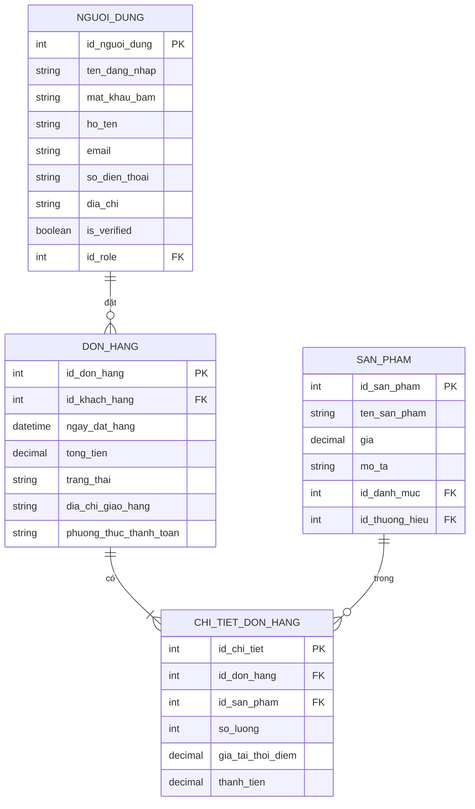
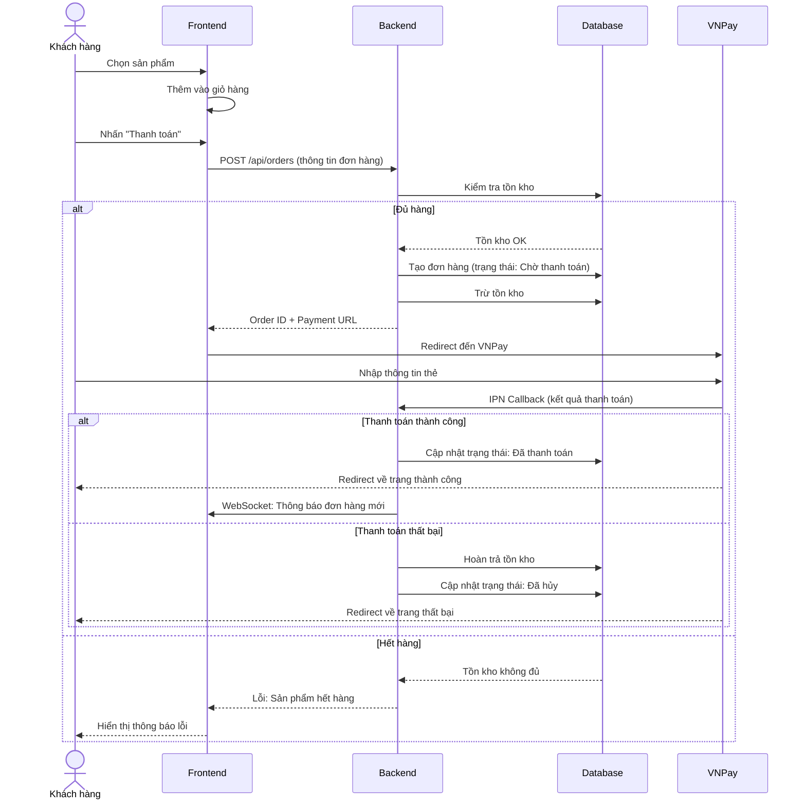
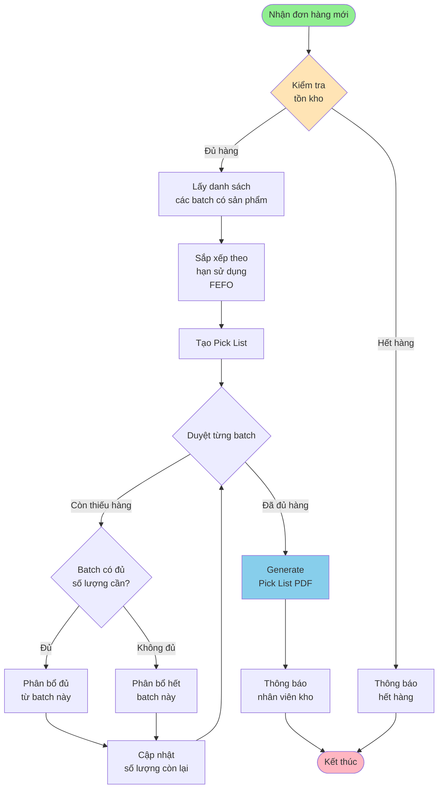
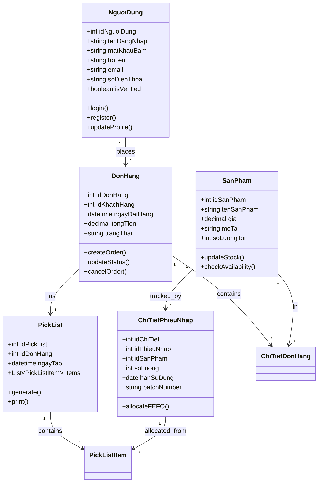
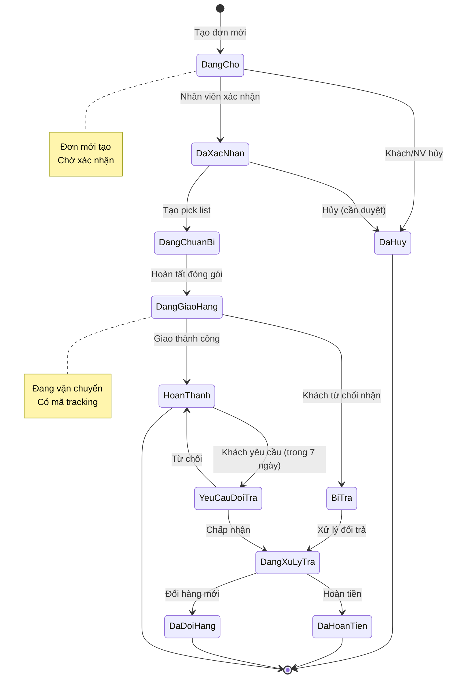
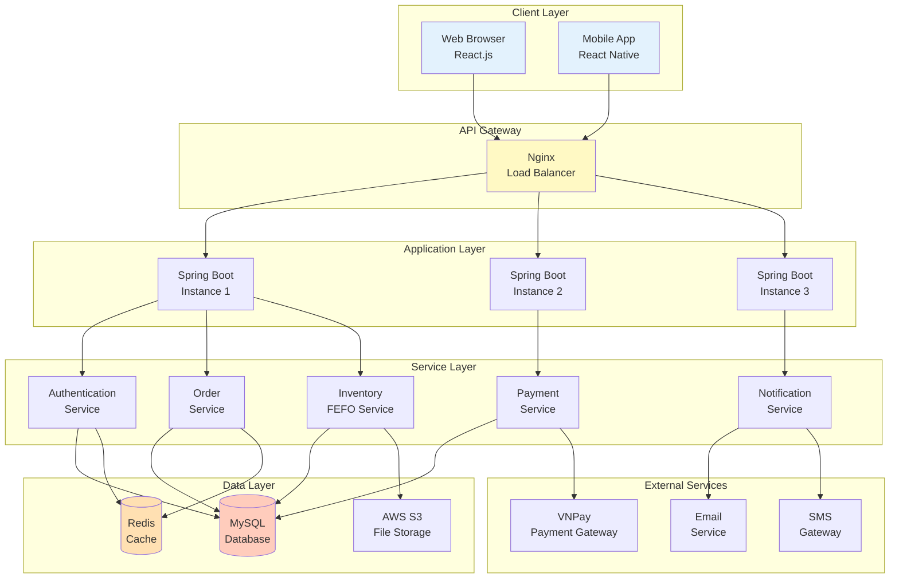

# TEMPLATES SƠ ĐỒ MERMAID

Tất cả các sơ đồ cho luận văn được viết bằng Mermaid - có thể hiển thị trực tiếp trong Markdown!

---

## 🎨 Cách xem sơ đồ Mermaid

### Trong VS Code:
1. Cài extension: "Markdown Preview Mermaid Support"
2. Mở file .md chứa sơ đồ
3. Nhấn `Ctrl+Shift+V` để preview

### Online:
- Truy cập: https://mermaid.live/
- Copy code vào và xem ngay

---

## 📊 1. ERD - Entity Relationship Diagram

### Xem file: `01_ERD_Database.md`



---

## 📊 2. Sequence Diagram - Quy trình đặt hàng

### Xem file: `02_Sequence_DatHang.md`



---

## 📊 3. Flowchart - Quy trình FEFO

### Xem file: `03_Flowchart_FEFO.md`



---

## 📊 4. Class Diagram - Domain Model

### Xem file: `04_Class_Domain_Model.md`



---

## 📊 5. State Diagram - Trạng thái đơn hàng

### Xem file: `05_State_DonHang.md`



---

## 📊 6. Architecture Diagram - Kiến trúc hệ thống

### Xem file: `06_Architecture_System.md`



---

## 🚀 Hướng dẫn sử dụng

### 1. Xem trong Markdown:
- Mở file .md trong VS Code
- Preview với `Ctrl+Shift+V`
- Sơ đồ hiển thị trực tiếp!

### 2. Export ảnh:
```bash
# Cài mmdc CLI
npm install -g @mermaid-js/mermaid-cli

# Export PNG
mmdc -i diagram.md -o diagram.png

# Export SVG
mmdc -i diagram.md -o diagram.svg
```

### 3. Chỉnh sửa online:
- Vào https://mermaid.live/
- Paste code
- Chỉnh sửa và download

---

## 📝 Tips

1. **Màu sắc**: Thêm `style NodeName fill:#color` ở cuối
2. **Font tiếng Việt**: Mermaid hỗ trợ tốt Unicode
3. **Complexity**: Nếu sơ đồ quá phức tạp, chia nhỏ ra
4. **Version control**: File text nên Git friendly

---

**Happy Diagramming with Mermaid!** 🎨