# ERD - SƠ ĐỒ QUAN HỆ THỰC THỂ ĐẦY ĐỦ

Sơ đồ database hoàn chỉnh của hệ thống Perfume Shop Management System.

---

## Sơ đồ ERD đầy đủ

```mermaid
erDiagram
    %% ========================================
    %% NGƯỜI DÙNG VÀ PHÂN QUYỀN
    %% ========================================
    
    ROLES ||--o{ NGUOI_DUNG : "có"
    ROLES {
        int id_role PK
        string ten_role "ADMIN,STORE_MANAGER,etc"
        string mo_ta
        int muc_do_quyen
        timestamp created_at
    }
    
    NGUOI_DUNG ||--o{ DON_HANG : "đặt"
    NGUOI_DUNG ||--o{ DANH_GIA : "viết"
    NGUOI_DUNG {
        int id_nguoi_dung PK
        string ten_dang_nhap UK
        string mat_khau_bam
        string ho_ten
        string email
        string so_dien_thoai
        string dia_chi
        boolean is_verified
        string verification_token
        datetime token_expiry_time
        int id_role FK
        enum trang_thai "active,inactive,suspended"
    }
    
    %% ========================================
    %% SẢN PHẨM
    %% ========================================
    
    DANH_MUC ||--o{ SAN_PHAM : "chứa"
    THUONG_HIEU ||--o{ SAN_PHAM : "sản xuất"
    
    DANH_MUC {
        int id_danh_muc PK
        string ten_danh_muc
        string mo_ta
        int danh_muc_cha_id FK "Self-reference"
    }
    
    THUONG_HIEU {
        int id_thuong_hieu PK
        string ten_thuong_hieu
        string quoc_gia
        string mo_ta
    }
    
    SAN_PHAM ||--o{ HINH_ANH_SAN_PHAM : "có"
    SAN_PHAM ||--o{ CHI_TIET_DON_HANG : "trong"
    SAN_PHAM ||--o{ CHI_TIET_PHIEU_NHAP : "nhập"
    SAN_PHAM ||--o{ DANH_GIA : "được đánh giá"
    SAN_PHAM ||--o{ SAN_PHAM_DE_XUAT : "đề xuất"
    
    SAN_PHAM {
        int id_san_pham PK
        string ten_san_pham
        string mo_ta
        decimal gia
        int so_luong_ton
        int id_danh_muc FK
        int id_thuong_hieu FK
        string dung_tich "50ml,100ml,etc"
        string nong_do "EDT,EDP,Parfum"
        string mui_huong "floral,woody,etc"
        string gioi_tinh "Nam,Nữ,Unisex"
        boolean is_active
        timestamp created_at
        timestamp updated_at
    }
    
    HINH_ANH_SAN_PHAM {
        int id_hinh_anh PK
        int id_san_pham FK
        string url_hinh_anh
        boolean is_primary
        int thu_tu
    }
    
    %% ========================================
    %% ĐƠN HÀNG
    %% ========================================
    
    DON_HANG ||--|{ CHI_TIET_DON_HANG : "gồm"
    DON_HANG ||--o| THANH_TOAN : "có"
    DON_HANG ||--o| PHIEU_DOI_TRA : "được yêu cầu"
    
    DON_HANG {
        int id_don_hang PK
        int id_khach_hang FK
        datetime ngay_dat_hang
        decimal tong_tien
        decimal phi_van_chuyen
        decimal giam_gia
        decimal thanh_tien
        string trang_thai "Chờ,XácNhận,ChuẩnBị,GiaoHàng,HoànThành,Hủy"
        string ho_ten_nguoi_nhan
        string so_dien_thoai_nguoi_nhan
        string dia_chi_giao_hang
        string ghi_chu
        string ma_van_don
        int id_nhan_vien_xu_ly FK
        timestamp created_at
        timestamp updated_at
    }
    
    CHI_TIET_DON_HANG {
        int id_chi_tiet PK
        int id_don_hang FK
        int id_san_pham FK
        int so_luong
        decimal gia_tai_thoi_diem
        decimal thanh_tien
    }
    
    THANH_TOAN {
        int id_thanh_toan PK
        int id_don_hang FK
        decimal so_tien
        string phuong_thuc "COD,VNPay,Chuyển khoản"
        string trang_thai "Chờ,ThànhCông,ThấtBại,HoànTiền"
        string ma_giao_dich_vnpay
        string response_code
        datetime ngay_thanh_toan
    }
    
    %% ========================================
    %% KHO HÀNG - FEFO
    %% ========================================
    
    PHIEU_NHAP_KHO ||--|{ CHI_TIET_PHIEU_NHAP : "có"
    NHA_CUNG_CAP ||--o{ PHIEU_NHAP_KHO : "cung cấp"
    
    NHA_CUNG_CAP {
        int id_nha_cung_cap PK
        string ten_cong_ty
        string nguoi_lien_he
        string email
        string so_dien_thoai
        string dia_chi
        string ma_so_thue
        enum trang_thai "active,inactive"
    }
    
    PHIEU_NHAP_KHO {
        int id_phieu_nhap PK
        int id_nha_cung_cap FK
        datetime ngay_nhap
        decimal tong_tien
        string trang_thai "ChờDuyệt,ĐãDuyệt,Hủy"
        int id_nguoi_tao FK
        int id_nguoi_duyet FK
        string ghi_chu
    }
    
    CHI_TIET_PHIEU_NHAP ||--o{ PICK_LIST_ITEM : "phân bổ"
    
    CHI_TIET_PHIEU_NHAP {
        int id_chi_tiet PK
        int id_phieu_nhap FK
        int id_san_pham FK
        int so_luong
        int so_luong_con_lai "Cho FEFO"
        decimal gia_nhap
        date han_su_dung "FEFO key field"
        string batch_number
        string vi_tri_kho
        timestamp created_at
    }
    
    %% ========================================
    %% PICK LIST - FEFO ALLOCATION
    %% ========================================
    
    DON_HANG ||--o| PICK_LIST : "có"
    PICK_LIST ||--|{ PICK_LIST_ITEM : "gồm"
    
    PICK_LIST {
        int id_pick_list PK
        int id_don_hang FK
        datetime ngay_tao
        string trang_thai "ChờLấy,ĐangLấy,HoànThành"
        int id_nhan_vien_kho FK
        timestamp created_at
    }
    
    PICK_LIST_ITEM {
        int id_item PK
        int id_pick_list FK
        int id_san_pham FK
        int id_chi_tiet_phieu_nhap FK "Batch nguồn"
        int so_luong
        string vi_tri_kho
        date han_su_dung
        string batch_number
    }
    
    %% ========================================
    %% ĐÁNH GIÁ
    %% ========================================
    
    DANH_GIA {
        int id_danh_gia PK
        int id_san_pham FK
        int id_nguoi_dung FK
        int so_sao "1-5"
        string noi_dung
        datetime ngay_danh_gia
        boolean is_verified "Từ đơn hàng thật"
    }
    
    %% ========================================
    %% PROCUREMENT (ĐẤU THẦU)
    %% ========================================
    
    PHIEU_GOI_THAU ||--|{ SAN_PHAM_DE_XUAT : "nhận"
    
    PHIEU_GOI_THAU {
        int id_phieu_goi_thau PK
        string tieu_de
        string mo_ta
        datetime ngay_bat_dau
        datetime ngay_ket_thuc
        string trang_thai "MởThầu,ĐóngThầu,ĐãChọn"
        int id_nguoi_tao FK
        timestamp created_at
    }
    
    NHA_CUNG_CAP ||--o{ SAN_PHAM_DE_XUAT : "đề xuất"
    
    SAN_PHAM_DE_XUAT {
        int id_de_xuat PK
        int id_phieu_goi_thau FK
        int id_nha_cung_cap FK
        int id_san_pham FK "Tham chiếu nếu có"
        string ten_san_pham_de_xuat
        string mo_ta
        decimal gia_de_xuat
        int so_luong_toi_thieu
        string trang_thai "ChờDuyệt,ĐãDuyệt,TừChối,TrúngThầu"
        string ghi_chu_duyet
        timestamp created_at
    }
    
    %% ========================================
    %% ĐỔI TRẢ
    %% ========================================
    
    PHIEU_DOI_TRA ||--|{ CHI_TIET_DOI_TRA : "có"
    
    PHIEU_DOI_TRA {
        int id_phieu_doi_tra PK
        int id_don_hang FK
        int id_khach_hang FK
        string ly_do
        string trang_thai "ChờDuyệt,ĐãDuyệt,TừChối,ĐãXửLý"
        decimal so_tien_hoan
        int id_nguoi_duyet FK
        string ghi_chu_duyet
        timestamp ngay_tao
        timestamp ngay_xu_ly
    }
    
    CHI_TIET_DOI_TRA {
        int id_chi_tiet PK
        int id_phieu_doi_tra FK
        int id_san_pham FK
        int so_luong
        decimal gia_tra
        string tinh_trang "Nguyên vẹn,Đã sử dụng,Hư hỏng"
    }
    
    %% ========================================
    %% SỰ KIỆN & KHUYẾN MÃI
    %% ========================================
    
    SU_KIEN ||--o{ VOUCHER : "tạo"
    
    SU_KIEN {
        int id_su_kien PK
        string ten_su_kien
        string mo_ta
        datetime ngay_bat_dau
        datetime ngay_ket_thuc
        decimal phan_tram_giam
        boolean is_active
        string banner_url
    }
    
    VOUCHER ||--o{ DON_HANG : "áp dụng cho"
    
    VOUCHER {
        int id_voucher PK
        string ma_voucher UK
        int id_su_kien FK
        decimal gia_tri_giam
        string loai_giam "PhanTram,SoTien"
        decimal don_hang_toi_thieu
        int so_luong
        int so_luong_da_dung
        datetime ngay_het_han
        boolean is_active
    }
    
    %% ========================================
    %% AUDIT LOG
    %% ========================================
    
    AUDIT_LOGS {
        bigint id_log PK
        int id_nguoi_dung FK
        string action "CREATE,UPDATE,DELETE"
        string resource "Order,Product,User"
        int resource_id
        string ip_address
        string user_agent
        timestamp timestamp
    }
```

---

## Giải thích các quan hệ chính

### 1. Người dùng & Phân quyền
- 1 Role → nhiều Người dùng (1:N)
- Hỗ trợ 6 vai trò: Admin, Store Manager, Warehouse Staff, Sales Staff, Supplier, Customer

### 2. Sản phẩm
- 1 Danh mục → nhiều Sản phẩm (1:N)
- 1 Thương hiệu → nhiều Sản phẩm (1:N)
- 1 Sản phẩm → nhiều Hình ảnh (1:N)

### 3. Đơn hàng
- 1 Người dùng → nhiều Đơn hàng (1:N)
- 1 Đơn hàng → nhiều Chi tiết đơn hàng (1:N)
- 1 Đơn hàng → 1 Thanh toán (1:1)
- 1 Đơn hàng → 1 Pick List (1:1)

### 4. Kho hàng - FEFO
- **Chi tiết phiếu nhập** là đơn vị quản lý FEFO
- Mỗi batch có: `han_su_dung`, `so_luong_con_lai`, `batch_number`
- Pick List được tạo tự động theo FEFO: ưu tiên batch hết hạn sớm nhất

### 5. Procurement
- 1 Phiếu gọi thầu → nhiều Sản phẩm đề xuất (1:N)
- 1 Nhà cung cấp → nhiều Sản phẩm đề xuất (1:N)

### 6. Đổi trả
- 1 Đơn hàng → 0..1 Phiếu đổi trả (1:0..1)
- 1 Phiếu đổi trả → nhiều Chi tiết đổi trả (1:N)

---

## Chú thích:
- **PK**: Primary Key
- **FK**: Foreign Key  
- **UK**: Unique Key
- **FEFO**: First Expired, First Out - Ưu tiên xuất hàng hết hạn sớm nhất

---

**Tổng cộng: 25 bảng**