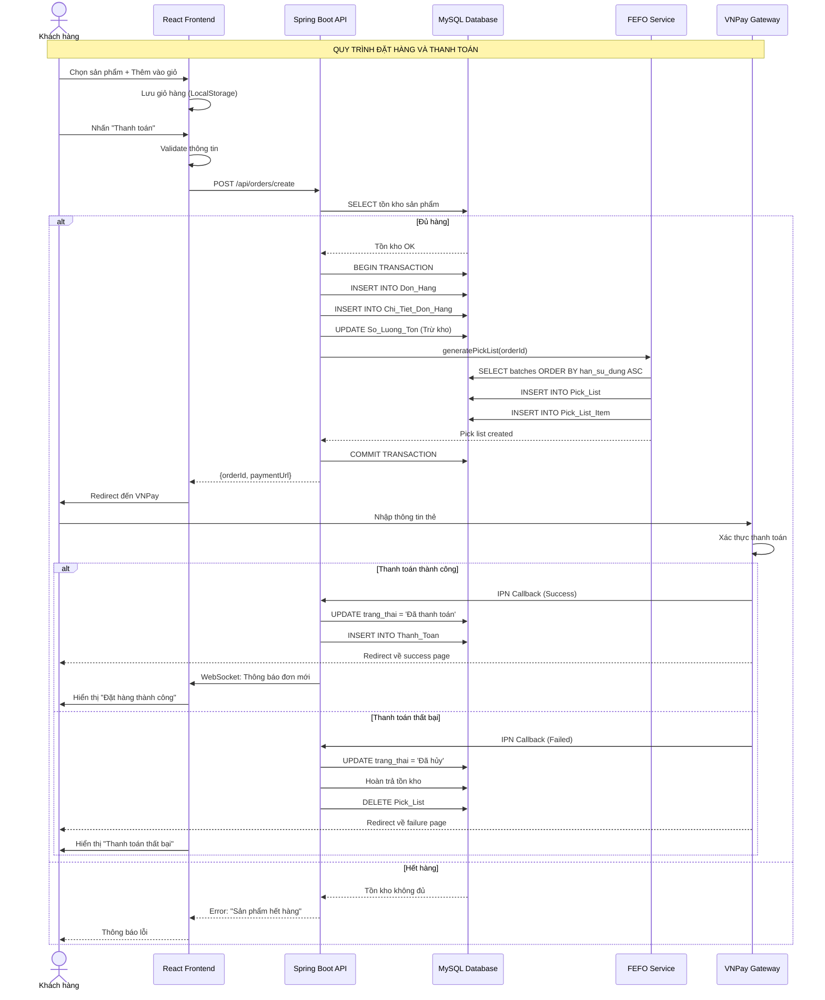
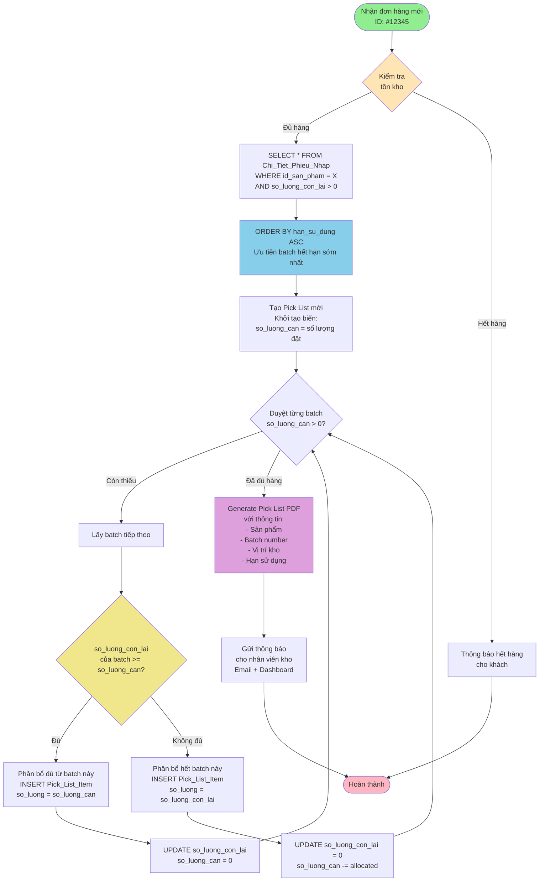
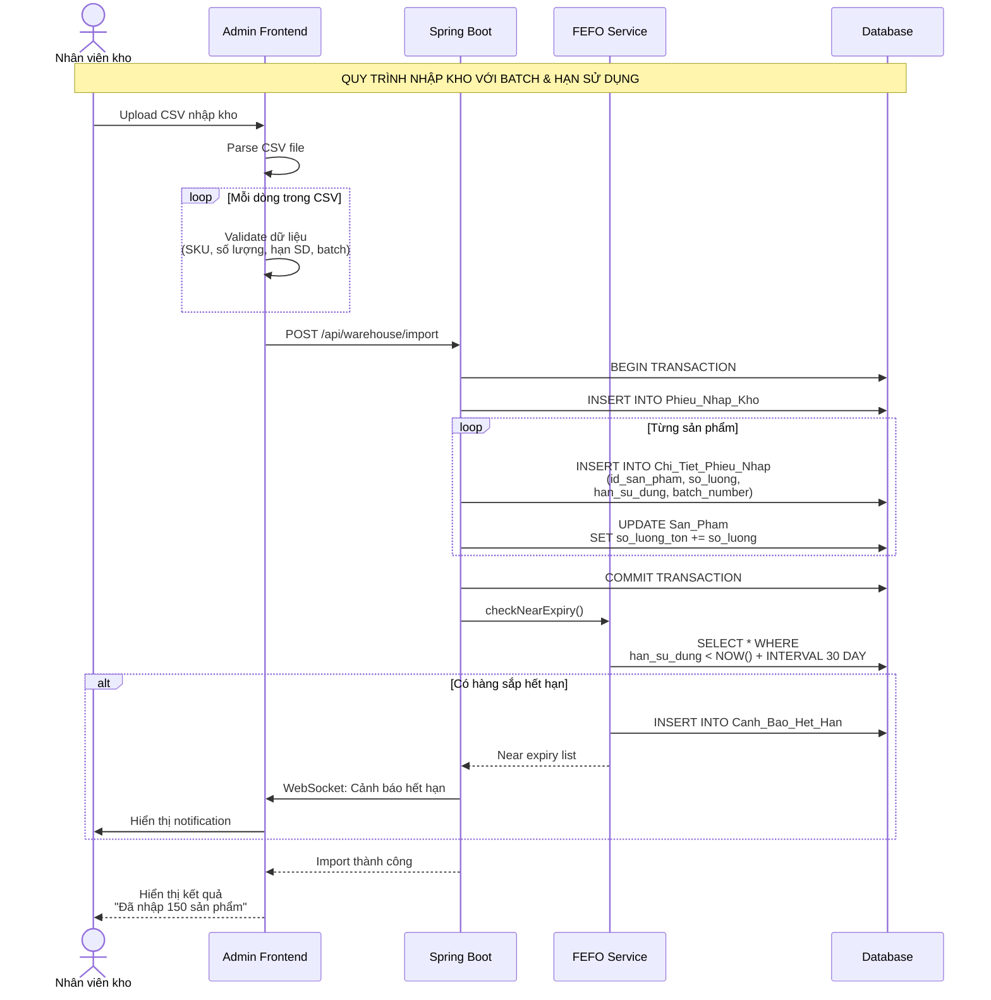
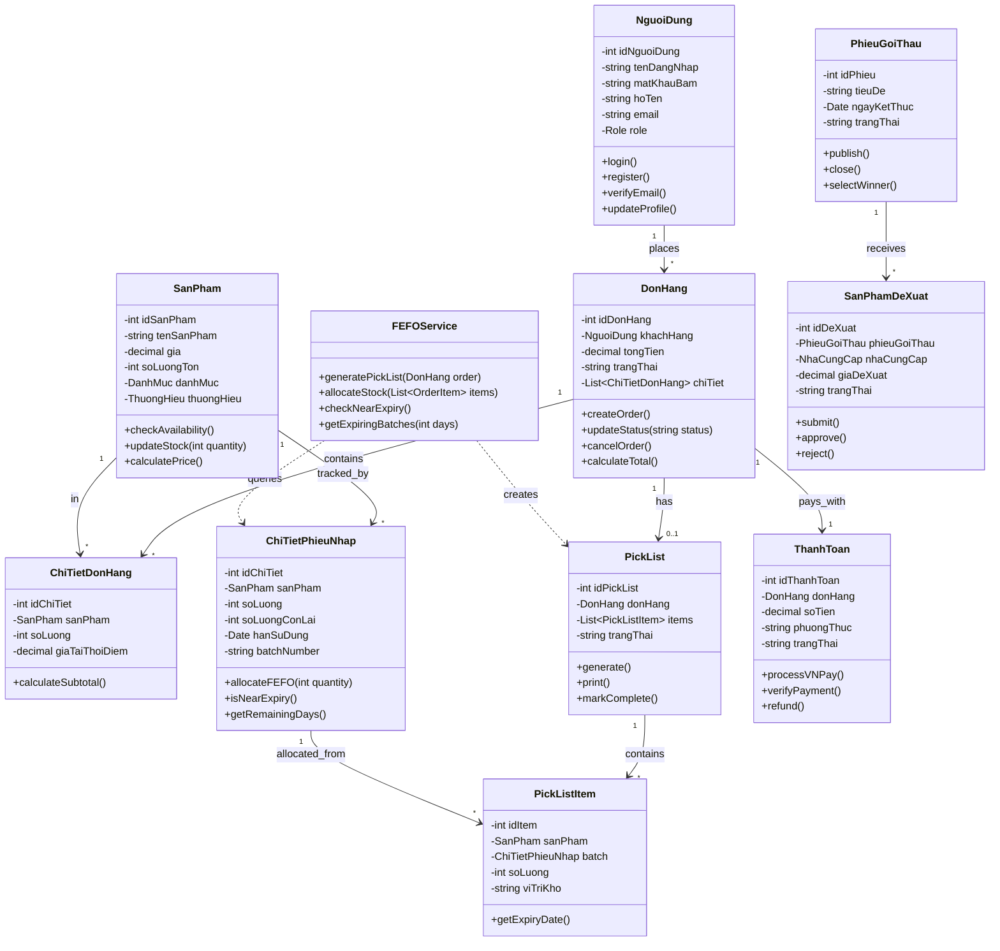
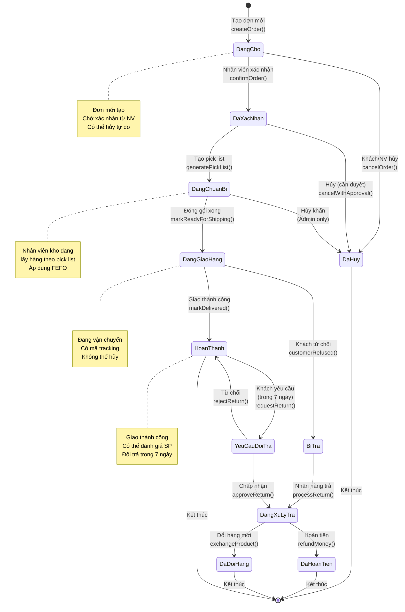
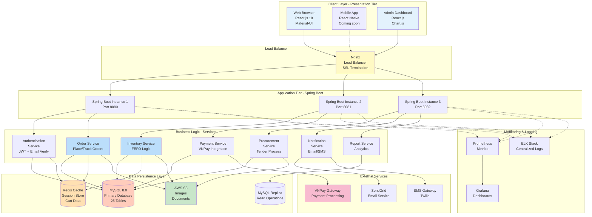

# TẤT CẢ SƠ ĐỒ HỆ THỐNG - ĐẦY ĐỦ

File này chứa tất cả các sơ đồ cần thiết cho luận văn, sẵn sàng sử dụng!

---

## 📊 1. ERD - Sơ đồ Database (Xem file riêng: 01_ERD_Full_Database.md)

**Đã tạo riêng với 25 bảng đầy đủ**

---

## 📊 2. SEQUENCE DIAGRAM - Đặt hàng & Thanh toán VNPay



---

## 📊 3. FLOWCHART - Quy trình FEFO (First Expired, First Out)



---

## 📊 4. SEQUENCE DIAGRAM - Nhập kho FEFO



---

## 📊 5. CLASS DIAGRAM - Domain Model



---

## 📊 6. STATE DIAGRAM - Trạng thái Đơn hàng



---

## 📊 7. ARCHITECTURE DIAGRAM - Kiến trúc hệ thống



---

## 🎯 Cách sử dụng

### 1. Xem trong VS Code:
```bash
# Cài extension
"Markdown Preview Mermaid Support"

# Mở file này
# Nhấn Ctrl+Shift+V
# Tất cả sơ đồ hiển thị!
```

### 2. Export PNG:
```bash
npm install -g @mermaid-js/mermaid-cli
mmdc -i ALL_DIAGRAMS_COMPLETE.md -o diagrams.png
```

### 3. Copy từng sơ đồ:
- Copy code của sơ đồ cần dùng
- Paste vào https://mermaid.live/
- Chỉnh sửa và download

---

**Đã hoàn thành: 7 loại sơ đồ chính cho luận văn!**