# SƠ ĐỒ LUẬN VĂN — THEO MẪU MAU_LVTN_2026

Đề tài: **XÂY DỰNG WEBSITE BÁN NƯỚC HOA TRỰC TUYẾN (PERFUMESHOP)**

Tài liệu này tổ chức toàn bộ sơ đồ Mermaid theo đúng cấu trúc gợi ý nội dung quyển luận văn
của Khoa CNTT. Cách đánh số hình theo quy định: *Hình X-Y* = hình số Y ở chương X.
Khi đưa vào Word: xuất hình từ [mermaid.live](https://mermaid.live), canh giữa,
chú thích hình gạch dưới - in đậm - in nghiêng phần số thứ tự.

---

# Chương 2. PHƯƠNG PHÁP THỰC HIỆN

## 2.3 CÔNG NGHỆ SỬ DỤNG

*Hình 2-1: Kiến trúc công nghệ tổng thể của hệ thống.*

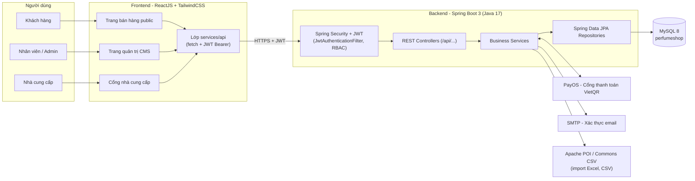

---

## 2.4 PHÂN TÍCH YÊU CẦU

### 2.4.1 Các quy trình, nghiệp vụ

#### 2.4.1.1 Quy trình đặt hàng và thanh toán

Khách hàng chọn sản phẩm vào giỏ, đặt hàng với 2 phương thức: COD hoặc thanh toán
online qua PayOS. Hệ thống **không trừ kho tại thời điểm đặt** - kho chỉ bị trừ khi
nhân viên xác nhận đơn, nhằm đảm bảo tồn kho chỉ giảm cho đơn thực sự được xử lý.

*Hình 2-2: Quy trình đặt hàng và thanh toán.*

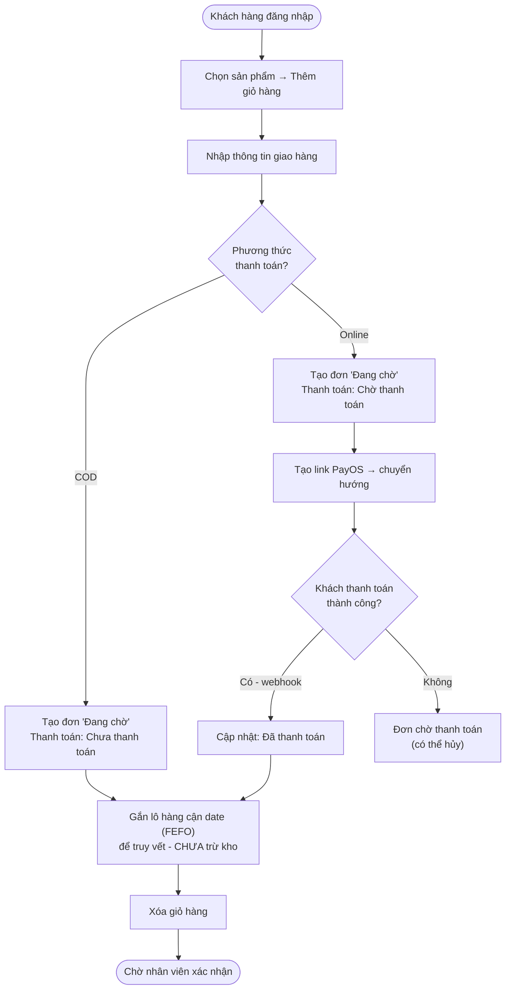

#### 2.4.1.2 Quy trình xử lý đơn hàng của nhân viên

*Hình 2-3: Quy trình xử lý đơn hàng.*

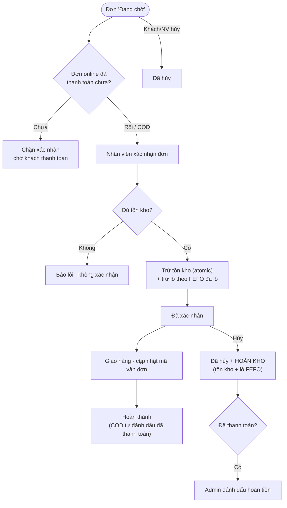

#### 2.4.1.3 Quy trình nhà cung cấp chào hàng - duyệt - nhập kho

Quy trình 4 giai đoạn với cơ chế kiểm soát chéo: NCC đề xuất → Admin duyệt sơ bộ
(sinh phiếu nhập PO) → Kho kiểm hàng thực tế → Admin duyệt cuối mới cộng kho và áp giá.

*Hình 2-4: Quy trình NCC chào hàng đến nhập kho.*

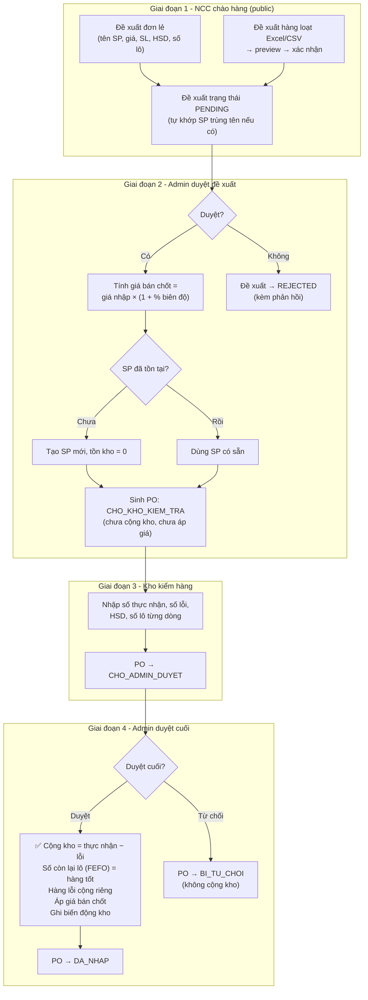

#### 2.4.1.4 Quy trình gọi thầu cạnh tranh

Admin tạo phiếu gọi thầu từ danh sách sản phẩm sắp hết kho (kèm gợi ý số lượng
theo tốc độ bán - Sales Velocity), các NCC chào giá cạnh tranh, admin so sánh và
chốt thầu, hệ thống tự sinh phiếu nhập PO đi tiếp quy trình kiểm kho ở Hình 2-4.

*Hình 2-5: Quy trình gọi thầu cạnh tranh.*

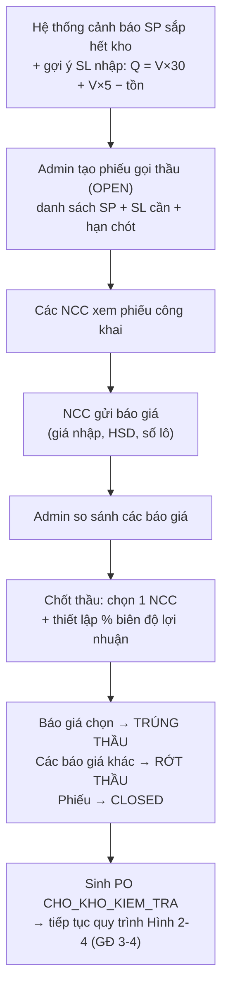

#### 2.4.1.5 Quy trình nhập kho thủ công qua CSV/Excel

*Hình 2-6: Quy trình nhập kho qua tập tin.*

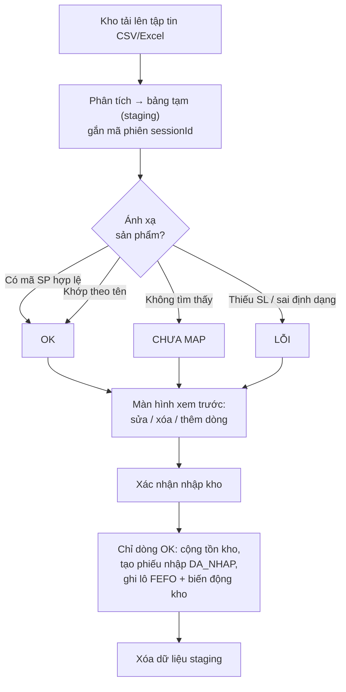

#### 2.4.1.6 Quy trình đổi trả - hoàn tiền

*Hình 2-7: Quy trình đổi trả và hoàn tiền.*

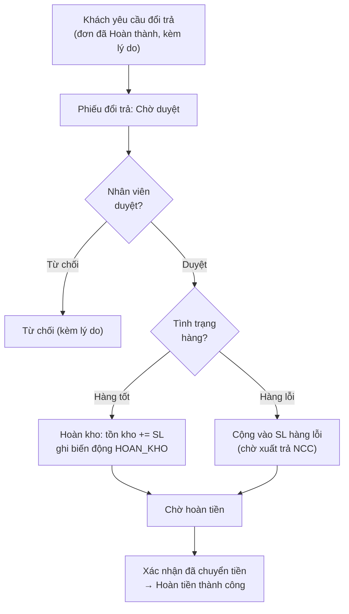

---

### 2.4.2 Sơ đồ chức năng

*Hình 2-8: Sơ đồ phân rã chức năng hệ thống.*

```mermaid
flowchart TD
    ROOT["HỆ THỐNG PERFUMESHOP"]

    ROOT --> F1["1. Quản lý tài khoản"]
    F1 --> F11["1.1 Đăng ký / Đăng nhập (JWT)"]
    F1 --> F12["1.2 Xác thực email"]
    F1 --> F13["1.3 Hồ sơ cá nhân, đổi mật khẩu"]
    F1 --> F14["1.4 Quản lý nhân viên - phân quyền"]
    F1 --> F15["1.5 Quản lý khách hàng"]

    ROOT --> F2["2. Bán hàng"]
    F2 --> F21["2.1 Danh mục SP: tìm kiếm, lọc,\nphân trang, SP liên quan"]
    F2 --> F22["2.2 Giỏ hàng"]
    F2 --> F23["2.3 Đặt hàng COD / PayOS"]
    F2 --> F24["2.4 Lịch sử đơn, hủy đơn"]
    F2 --> F25["2.5 Đánh giá sản phẩm"]
    F2 --> F26["2.6 Đổi trả - hoàn tiền"]

    ROOT --> F3["3. Quản lý vận hành"]
    F3 --> F31["3.1 Xử lý đơn: xác nhận, giao,\nhoàn thành, hủy, hoàn tiền"]
    F3 --> F32["3.2 CRUD sản phẩm / danh mục /\nthương hiệu"]
    F3 --> F33["3.3 Chiến dịch khuyến mãi (sự kiện)"]
    F3 --> F34["3.4 Quản lý đánh giá"]

    ROOT --> F4["4. Quản lý kho"]
    F4 --> F41["4.1 Nhập kho CSV/Excel (staging)"]
    F4 --> F42["4.2 Kiểm hàng PO - duyệt cuối"]
    F4 --> F43["4.3 Quản lý lô hàng FEFO,\ncảnh báo cận date"]
    F4 --> F44["4.4 Biến động kho, hàng bán chậm,\nxuất hàng lỗi"]

    ROOT --> F5["5. Mua hàng - Đấu thầu"]
    F5 --> F51["5.1 Tạo phiếu gọi thầu\n(gợi ý SL theo Sales Velocity)"]
    F5 --> F52["5.2 NCC chào giá / đề xuất SP"]
    F5 --> F53["5.3 Chốt thầu → sinh PO"]
    F5 --> F54["5.4 Duyệt đề xuất NCC\n(đơn lẻ + hàng loạt)"]

    ROOT --> F6["6. Thống kê - Báo cáo"]
    F6 --> F61["6.1 Dashboard tổng quan"]
    F6 --> F62["6.2 Báo cáo doanh thu, top SP"]
    F6 --> F63["6.3 Xuất Excel"]
```

---

### 2.4.3 Sơ đồ Use case tổng quát

**Bảng mô tả các Actor:**

| Actor | Mô tả |
|---|---|
| **Khách hàng** (CUSTOMER) | Người mua hàng; đăng ký tài khoản, đặt hàng, thanh toán, đổi trả, đánh giá |
| **Nhà cung cấp** (SUPPLIER/NCC) | Đối tác cung ứng; xem phiếu gọi thầu, chào giá, đề xuất sản phẩm mới |
| **Nhân viên kho** (WAREHOUSE_STAFF) | Kiểm hàng thực tế khi nhập, quản lý lô hàng, nhập kho tập tin |
| **Cửa hàng trưởng** (STORE_MANAGER) | Vận hành: xử lý đơn, CRUD sản phẩm, gọi thầu, duyệt đề xuất, duyệt đổi trả, duyệt cuối PO |
| **Giám đốc** (DIRECTOR) | Như Cửa hàng trưởng + xem báo cáo, dashboard, quản lý khách hàng |
| **Admin** (ADMIN) | Toàn quyền: thêm quản lý nhân viên, xóa sản phẩm/danh mục/thương hiệu/chiến dịch |
| **PayOS** (hệ thống ngoài) | Cổng thanh toán; nhận yêu cầu tạo link, gửi webhook kết quả thanh toán |

*Hình 2-9: Sơ đồ Use case tổng quát.*

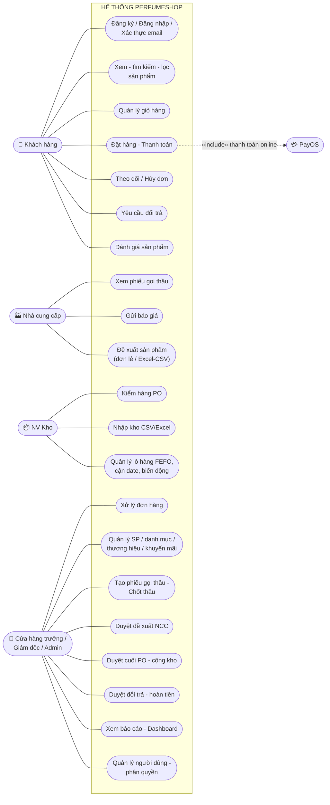

**Bảng mô tả sơ lược các Use case chính:**

| Use case | Actor | Mô tả sơ lược |
|---|---|---|
| Đặt hàng - Thanh toán | Khách hàng, PayOS | Tạo đơn từ giỏ hàng, chọn COD hoặc PayOS; chưa trừ kho |
| Xử lý đơn hàng | Quản lý | Xác nhận (trừ kho FEFO) → giao → hoàn thành; hủy thì hoàn kho |
| Gửi báo giá | NCC | Chào giá cho phiếu gọi thầu đang mở, kèm HSD và số lô |
| Đề xuất sản phẩm | NCC | Đề xuất SP mới độc lập hoặc hàng loạt qua tập tin |
| Duyệt đề xuất NCC | Quản lý | Duyệt → tạo SP + sinh PO chờ kho kiểm; hoặc từ chối kèm phản hồi |
| Kiểm hàng PO | NV Kho | Nhập số thực nhận, số lỗi, HSD, số lô cho từng dòng |
| Duyệt cuối PO | Quản lý | Cộng tồn kho hàng tốt, áp giá bán chốt, ghi biến động |
| Duyệt đổi trả | Quản lý | Hoàn kho (hàng tốt) hoặc ghi nhận hàng lỗi, xác nhận hoàn tiền |

---

# Chương 3. THIẾT KẾ

## 3.1 MÔ HÌNH DỮ LIỆU

### 3.1.1 Mức ý niệm (Conceptual)

*Hình 3-1: Mô hình dữ liệu mức ý niệm.*

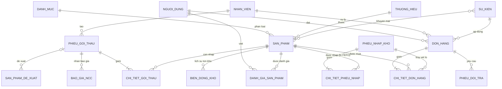

### 3.1.2 Mức luận lý (Logical) - đầy đủ thuộc tính

*Hình 3-2: Mô hình dữ liệu mức luận lý.*

```mermaid
erDiagram
    NGUOI_DUNG {
        int id_nguoi_dung PK
        string ten_dang_nhap UK
        string mat_khau_bam
        string ho_ten
        string so_dien_thoai
        string dia_chi
        string email
        boolean is_verified
        string vai_tro "CUSTOMER | SUPPLIER"
        string verification_token
        datetime token_expiry_time
    }

    NHAN_VIEN {
        int id_nhan_vien PK
        string ten_dang_nhap UK
        string mat_khau_bam
        string ho_ten
        string vai_tro "ADMIN | DIRECTOR | STORE_MANAGER | WAREHOUSE_STAFF"
    }

    DANH_MUC {
        int id_danh_muc PK
        string ten_danh_muc
    }

    THUONG_HIEU {
        int id_thuong_hieu PK
        string ten_thuong_hieu UK
        string url_hinh_anh
    }

    SAN_PHAM {
        int id_san_pham PK
        string ten_san_pham
        string mo_ta
        string url_hinh_anh
        decimal gia_ban
        int dung_tich_ml
        int nong_do
        int so_luong_ton_kho
        int so_luong_hang_loi
        int phan_tram_giam
        datetime ngay_bat_dau_giam
        datetime ngay_ket_thuc_giam
        int id_danh_muc FK
        int id_thuong_hieu FK
    }

    SU_KIEN {
        int id_su_kien PK
        string ten_su_kien
        string banner_url
        datetime ngay_bat_dau
        datetime ngay_ket_thuc
        boolean trang_thai_active
        decimal giam_gia_hang_loat
    }

    SU_KIEN_SAN_PHAM {
        int id_su_kien FK
        int id_san_pham FK
    }

    DON_HANG {
        int id_don_hang PK
        int id_nguoi_dung FK
        int id_nhan_vien FK
        string trang_thai_van_hanh
        string trang_thai_thanh_toan
        decimal tong_tien
        string ma_van_don
        string so_dien_thoai
        string phuong_thuc_thanh_toan
        string ten_nguoi_nhan
        string dia_chi_giao_hang
        datetime ngay_dat_hang
        datetime ngay_hoan_thanh
        string ly_do_huy
        string ghi_chu
        int id_su_kien FK
        decimal giam_gia_hang_loat
    }

    CHI_TIET_DON_HANG {
        int id_chi_tiet_don_hang PK
        int id_don_hang FK
        int id_san_pham FK
        int so_luong
        decimal gia_tai_thoi_diem_mua
        int id_phieu FK "lo nhap FEFO"
    }

    PHIEU_NHAP_KHO {
        int id_phieu PK
        string ma_phieu UK
        int id_nhan_vien FK
        string nha_cung_cap
        datetime ngay_nhap
        string ghi_chu
        decimal gia_ban_chot
        string trang_thai
    }

    CHI_TIET_PHIEU_NHAP {
        int id PK
        int id_phieu FK
        int id_san_pham FK
        string ten_san_pham_snapshot
        int so_luong
        decimal gia_nhap
        int so_luong_thuc_nhan
        int so_luong_loi
        int so_luong_con_lai "FEFO"
        date han_su_dung
        string so_lo
        string url_hinh_anh_moi
        string ghi_chu_kho
    }

    PHIEU_NHAP_TAM {
        int id PK
        string id_session
        string ten_san_pham_csv
        int id_san_pham FK
        int so_luong
        decimal gia_nhap
        date han_su_dung
        string so_lo
        string trang_thai "OK | CHUA_MAP | LOI"
        string loi
        int dong_so
        datetime ngay_tao
    }

    BIEN_DONG_KHO {
        int id PK
        int id_san_pham FK
        string ten_san_pham_snapshot
        string loai "NHAP | XUAT_BAN | HOAN_KHO | XUAT_LOI | DIEU_CHINH"
        int so_luong
        int ton_kho_sau
        string ly_do
        int id_don_hang FK
        int id_phieu_nhap FK
        int id_nhan_vien FK
        datetime ngay_tao
    }

    PHIEU_GOI_THAU {
        int id_phieu_goi_thau PK
        string ma_phieu UK
        string trang_thai "OPEN | CLOSED"
        string ghi_chu
        date han_chot
        int id_nhan_vien_tao FK
        datetime ngay_tao
        datetime ngay_cap_nhat
    }

    CHI_TIET_GOI_THAU {
        int id_chi_tiet PK
        int id_phieu_goi_thau FK
        int id_san_pham FK
        string ten_san_pham_snapshot
        int so_luong_can_nhap
        int ton_kho_hien_tai
        decimal gia_ban_hien_tai
        string ghi_chu
    }

    BAO_GIA_NCC {
        int id_bao_gia PK
        int id_phieu_goi_thau FK
        string ten_ncc
        string lien_he_ncc
        string trang_thai "CHO_DUYET | TRUNG_THAU | ROT_THAU"
        decimal gia_nhap_de_xuat
        decimal phan_tram_bien_do
        decimal gia_ban_chot
        date han_su_dung
        string so_lo
        datetime ngay_tao
    }

    SAN_PHAM_DE_XUAT {
        int id_san_pham_de_xuat PK
        int id_phieu_goi_thau FK "null neu doc lap"
        string ten_ncc
        string lien_he_ncc
        string ten_san_pham
        string mo_ta
        string url_hinh_anh
        decimal gia_de_xuat
        int so_luong_co_the_cung_cap
        int dung_tich_ml
        int nong_do
        string trang_thai "PENDING | APPROVED | REJECTED"
        int id_san_pham_tao_ra FK
        int id_san_pham_khop FK
        date han_su_dung
        string so_lo
        string phan_hoi_admin
        datetime ngay_tao
        datetime ngay_xu_ly
        int id_nhan_vien_xu_ly FK
    }

    PHIEU_DOI_TRA {
        int id_doi_tra PK
        int id_don_hang FK
        int id_nguoi_dung FK
        int id_nhan_vien FK
        string ly_do
        string ly_do_tu_choi
        string ghi_chu_noi_bo
        decimal so_tien_hoan
        datetime ngay_hoan_tien
        string trang_thai
        datetime ngay_tao
    }

    DANH_GIA_SAN_PHAM {
        int id_danh_gia PK
        int id_san_pham FK
        int id_nguoi_dung FK
        int diem_danh_gia
        string binh_luan
        datetime ngay_tao
    }

    DANH_MUC ||--o{ SAN_PHAM : "phan loai"
    THUONG_HIEU ||--o{ SAN_PHAM : "thuoc"
    NGUOI_DUNG ||--o{ DON_HANG : "dat"
    NHAN_VIEN ||--o{ DON_HANG : "xu ly"
    DON_HANG ||--|{ CHI_TIET_DON_HANG : "gom"
    SAN_PHAM ||--o{ CHI_TIET_DON_HANG : "duoc mua"
    PHIEU_NHAP_KHO ||--o{ CHI_TIET_DON_HANG : "truy vet lo FEFO"
    SU_KIEN ||--o{ DON_HANG : "ap dung"
    SU_KIEN ||--o{ SU_KIEN_SAN_PHAM : ""
    SAN_PHAM ||--o{ SU_KIEN_SAN_PHAM : ""
    NHAN_VIEN ||--o{ PHIEU_NHAP_KHO : "tao - duyet"
    PHIEU_NHAP_KHO ||--|{ CHI_TIET_PHIEU_NHAP : "gom"
    SAN_PHAM ||--o{ CHI_TIET_PHIEU_NHAP : "duoc nhap"
    SAN_PHAM ||--o{ PHIEU_NHAP_TAM : "map"
    SAN_PHAM ||--o{ BIEN_DONG_KHO : "lich su"
    DON_HANG ||--o{ BIEN_DONG_KHO : "phat sinh"
    PHIEU_NHAP_KHO ||--o{ BIEN_DONG_KHO : "phat sinh"
    NHAN_VIEN ||--o{ PHIEU_GOI_THAU : "tao"
    PHIEU_GOI_THAU ||--|{ CHI_TIET_GOI_THAU : "gom"
    SAN_PHAM ||--o{ CHI_TIET_GOI_THAU : "can nhap"
    PHIEU_GOI_THAU ||--o{ BAO_GIA_NCC : "nhan bao gia"
    PHIEU_GOI_THAU |o--o{ SAN_PHAM_DE_XUAT : "de xuat trong phieu"
    SAN_PHAM |o--o{ SAN_PHAM_DE_XUAT : "tao ra - khop"
    NHAN_VIEN ||--o{ SAN_PHAM_DE_XUAT : "duyet"
    DON_HANG ||--o{ PHIEU_DOI_TRA : "yeu cau"
    NGUOI_DUNG ||--o{ PHIEU_DOI_TRA : "tao"
    NHAN_VIEN ||--o{ PHIEU_DOI_TRA : "xu ly"
    SAN_PHAM ||--o{ DANH_GIA_SAN_PHAM : "duoc danh gia"
    NGUOI_DUNG ||--o{ DANH_GIA_SAN_PHAM : "viet"
```

### 3.1.3 Mức vật lý (Physical)

Mức vật lý là lược đồ MySQL thực tế - tham chiếu tập tin `perfumeshop.sql`.
Bảng tóm tắt 18 bảng dữ liệu:

| # | Bảng | Vai trò | Khóa chính |
|---|---|---|---|
| 1 | `nguoi_dung` | Tài khoản khách hàng / NCC | id_nguoi_dung |
| 2 | `nhan_vien` | Tài khoản nhân viên nội bộ | id_nhan_vien |
| 3 | `danh_muc` | Danh mục sản phẩm | id_danh_muc |
| 4 | `thuong_hieu` | Thương hiệu | id_thuong_hieu |
| 5 | `san_pham` | Sản phẩm (tồn kho, giá, giảm giá) | id_san_pham |
| 6 | `su_kien` | Chiến dịch khuyến mãi | id_su_kien |
| 7 | `su_kien_san_pham` | Bảng nối sự kiện - sản phẩm | (id_su_kien, id_san_pham) |
| 8 | `don_hang` | Đơn hàng | id_don_hang |
| 9 | `chi_tiet_don_hang` | Chi tiết đơn (kèm lô FEFO) | id_chi_tiet_don_hang |
| 10 | `phieu_nhap_kho` | Phiếu nhập / PO | id_phieu |
| 11 | `chi_tiet_phieu_nhap` | Dòng lô nhập (HSD, số lô, còn lại) | id |
| 12 | `phieu_nhap_tam` | Staging import CSV/Excel | id |
| 13 | `bien_dong_kho` | Nhật ký biến động tồn kho | id |
| 14 | `phieu_goi_thau` | Phiếu gọi thầu | id_phieu_goi_thau |
| 15 | `chi_tiet_goi_thau` | SP cần nhập trong phiếu thầu | id_chi_tiet |
| 16 | `bao_gia_ncc` | Báo giá của NCC | id_bao_gia |
| 17 | `san_pham_de_xuat` | Sản phẩm NCC đề xuất | id_san_pham_de_xuat |
| 18 | `phieu_doi_tra` | Phiếu đổi trả | id_doi_tra |

*(Bảng `danh_gia_san_pham` - đánh giá sản phẩm - bổ sung thứ 19.)*

---

## 3.2 MÔ HÌNH XỬ LÝ

### 3.2.1 Use case chi tiết (kèm bảng mô tả)

#### Bảng 3-1: Use case "Đặt hàng"

| Mục | Nội dung |
|---|---|
| **Tên Use case** | Đặt hàng |
| **Actor** | Khách hàng, PayOS |
| **Mô tả** | Khách hàng đặt mua các sản phẩm trong giỏ và chọn phương thức thanh toán |
| **Điều kiện tiên quyết** | Khách hàng đã đăng nhập; giỏ hàng có ít nhất 1 sản phẩm |
| **Luồng chính** | 1. Khách vào trang thanh toán. 2. Nhập tên, SĐT, địa chỉ nhận. 3. Chọn COD hoặc online. 4. Hệ thống tạo đơn "Đang chờ", gắn lô FEFO truy vết, tính tổng tiền (giá khuyến mãi + giảm giá sự kiện), sinh mã vận đơn, xóa giỏ. 5. Nếu online: tạo link PayOS và chuyển hướng |
| **Luồng phụ** | 4a. Thiếu tồn kho và không cho backorder → đơn chuyển "Chờ hàng". 5a. PayOS webhook cập nhật "Đã thanh toán" |
| **Ngoại lệ** | Giỏ rỗng, SP không tồn tại, không tạo được link thanh toán → báo lỗi |
| **Hậu điều kiện** | Đơn hàng lưu DB, tồn kho CHƯA bị trừ |

#### Bảng 3-2: Use case "Xác nhận đơn hàng"

| Mục | Nội dung |
|---|---|
| **Tên Use case** | Xác nhận đơn hàng |
| **Actor** | Nhân viên quản lý |
| **Mô tả** | Xác nhận đơn "Đang chờ" và trừ tồn kho theo nguyên tắc FEFO |
| **Điều kiện tiên quyết** | Đơn ở trạng thái "Đang chờ"; đơn online phải "Đã thanh toán" |
| **Luồng chính** | 1. NV mở danh sách đơn chờ. 2. Bấm xác nhận. 3. Hệ thống trừ tồn kho atomic từng SP. 4. Trừ số lượng còn lại của lô theo FEFO đa lô (lô HSD sớm hết → sang lô kế). 5. Đơn → "Đã xác nhận" |
| **Ngoại lệ** | 3a. Không đủ tồn → hủy giao dịch, báo lỗi. 4a. Không có dữ liệu lô (dữ liệu cũ) → ghi log cảnh báo, không chặn |
| **Hậu điều kiện** | Tồn kho và lô FEFO đã giảm tương ứng |

#### Bảng 3-3: Use case "Đề xuất sản phẩm (NCC)"

| Mục | Nội dung |
|---|---|
| **Tên Use case** | Đề xuất sản phẩm |
| **Actor** | Nhà cung cấp |
| **Mô tả** | NCC chủ động gửi đề nghị bán sản phẩm (không cần phiếu gọi thầu) |
| **Điều kiện tiên quyết** | Không (endpoint công khai) |
| **Luồng chính** | 1. NCC nhập tên SP, mô tả, giá đề xuất, SL, dung tích, nồng độ, HSD, số lô. 2. Hệ thống validate (tên + giá > 0, HSD không quá khứ). 3. Tự khớp với SP trùng tên nếu có. 4. Lưu đề xuất PENDING |
| **Luồng phụ** | Hàng loạt: tải file Excel/CSV → preview từng dòng (OK/LỖI) → xác nhận commit các dòng OK |
| **Ngoại lệ** | Thiếu tên/giá, HSD quá khứ, phiên preview hết hạn (30 phút) → báo lỗi |
| **Hậu điều kiện** | Đề xuất chờ admin duyệt |

#### Bảng 3-4: Use case "Duyệt cuối PO - cộng kho"

| Mục | Nội dung |
|---|---|
| **Tên Use case** | Duyệt cuối phiếu nhập (PO) |
| **Actor** | Nhân viên quản lý (ADMIN/DIRECTOR/STORE_MANAGER) |
| **Mô tả** | Bước cuối quy trình nhập hàng: cộng tồn kho và áp giá bán |
| **Điều kiện tiên quyết** | PO ở trạng thái CHO_ADMIN_DUYET (kho đã kiểm hàng) |
| **Luồng chính** | 1. Admin xem PO kèm số thực nhận / số lỗi kho đã nhập. 2. Bấm duyệt. 3. Từng dòng: tồn kho += (thực nhận − lỗi); số còn lại lô = hàng tốt; hàng lỗi cộng riêng; áp giá bán chốt; ghi biến động NHAP/XUAT_LOI. 4. PO → DA_NHAP |
| **Luồng phụ** | Admin từ chối kèm lý do → PO → BI_TU_CHOI, không cộng kho |
| **Ngoại lệ** | PO sai trạng thái → báo lỗi |
| **Hậu điều kiện** | Tồn kho tăng, lô FEFO sẵn sàng xuất bán, giá bán cập nhật |

### 3.2.2 Sơ đồ tuần tự

*Hình 3-3: Sơ đồ tuần tự - Đặt hàng và thanh toán.*

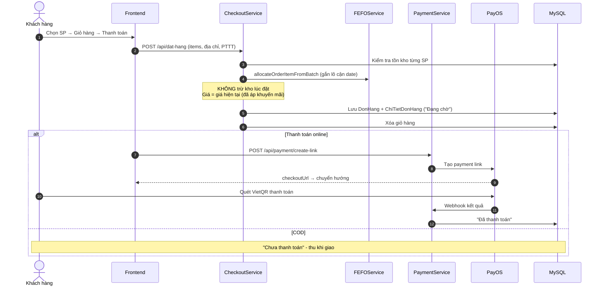

*Hình 3-4: Sơ đồ tuần tự - Xác nhận đơn, trừ kho FEFO đa lô.*

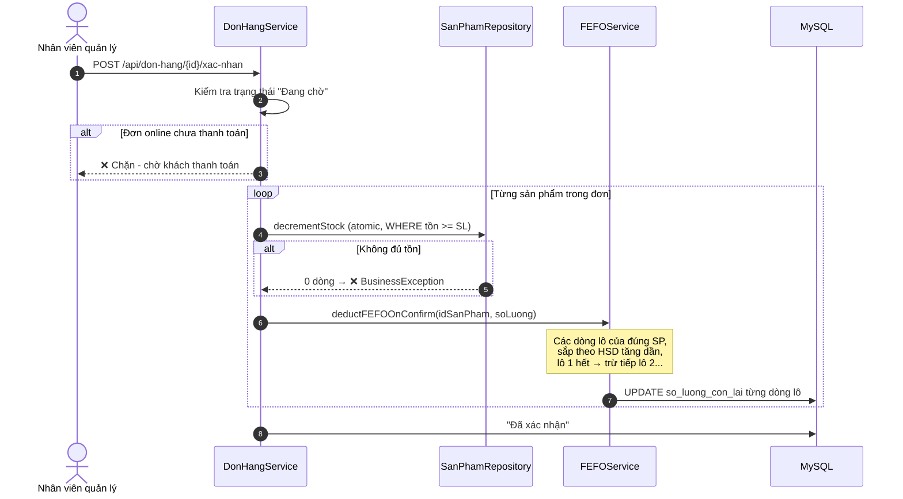

*Hình 3-5: Sơ đồ tuần tự - NCC chào hàng → duyệt → kho kiểm → cộng kho.*

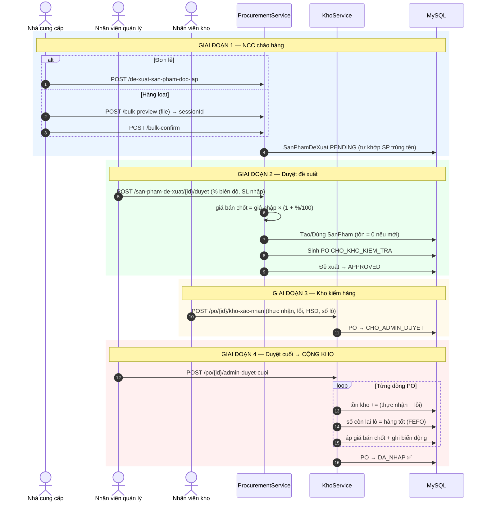

*Hình 3-6: Sơ đồ tuần tự - Gọi thầu cạnh tranh.*

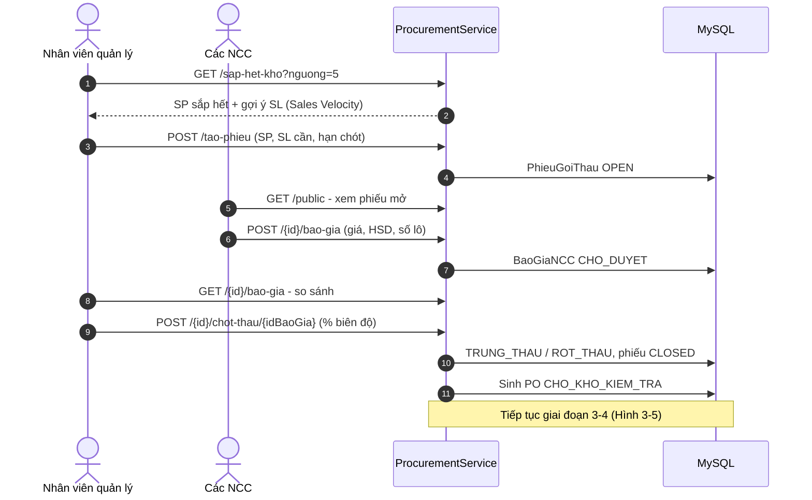

*Hình 3-7: Sơ đồ tuần tự - Đổi trả và hoàn tiền.*

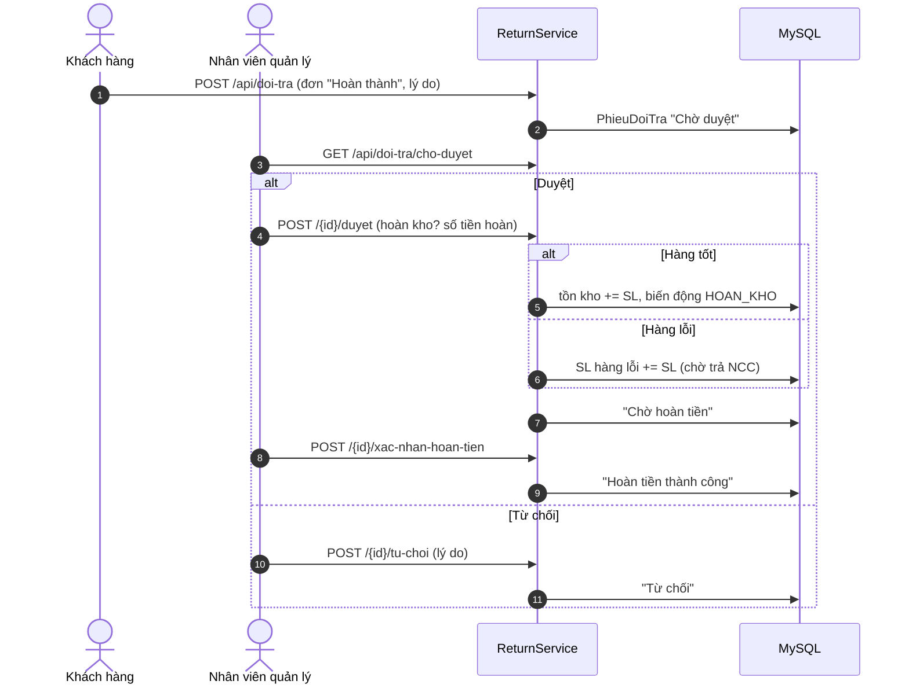

### 3.2.3 Sơ đồ hoạt động (Activity)

*Hình 3-8: Sơ đồ trạng thái vòng đời đơn hàng.*

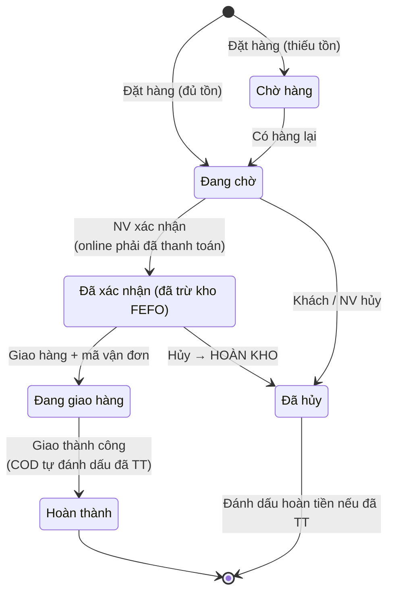

*Hình 3-9: Sơ đồ trạng thái thanh toán.*

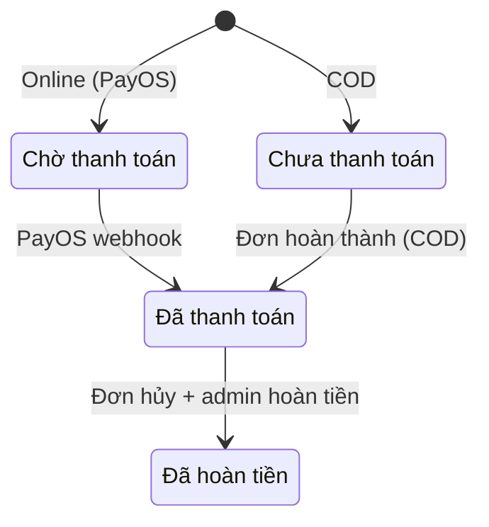

*Hình 3-10: Sơ đồ trạng thái phiếu nhập kho (PO).*

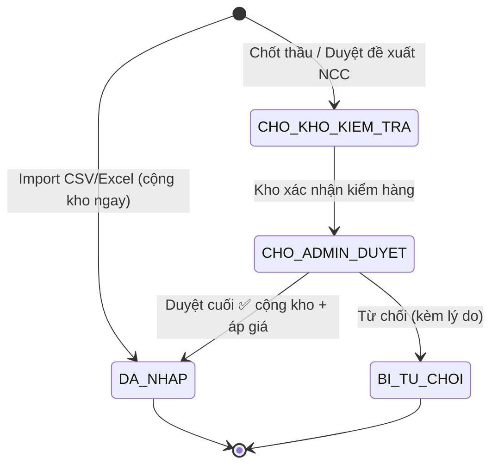

*Hình 3-11: Sơ đồ trạng thái gọi thầu / báo giá / đề xuất / đổi trả.*

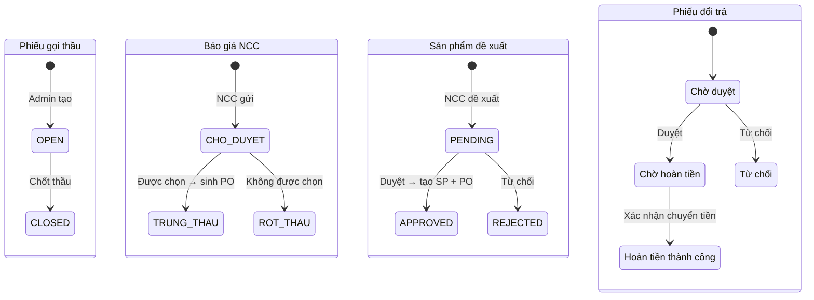

*Hình 3-12: Sơ đồ phân quyền hệ thống (RBAC).*

```mermaid
flowchart TD
    ADMIN["ADMIN (root)"] -->|"toàn quyền +"| P1["Quản lý nhân viên<br/>DELETE SP / danh mục / thương hiệu / chiến dịch"]
    DIR["DIRECTOR"] --> P2["Quản lý khách hàng · Dashboard · Báo cáo"]
    SM["STORE_MANAGER"] --> P3["CRUD sản phẩm · Gọi thầu · Duyệt đề xuất<br/>Chiến dịch · Duyệt đổi trả · Duyệt cuối PO · QL đánh giá"]
    WH["WAREHOUSE_STAFF"] --> P4["Kho: kiểm hàng PO, import CSV, lô hàng,<br/>biến động (KHÔNG duyệt cuối PO)"]
    CUS["CUSTOMER"] --> P5["Giỏ hàng · Đặt hàng · Lịch sử · Đổi trả ·<br/>Đánh giá · Hồ sơ"]
    SUP["SUPPLIER"] --> P6["Cổng NCC: chào giá, đề xuất SP"]
    PUB["Public"] --> P7["Xem catalog · Đăng ký / Đăng nhập ·<br/>Endpoint NCC công khai · PayOS webhook"]

    ADMIN -.kế thừa.-> DIR -.kế thừa.-> SM -.kế thừa.-> WH
    style ADMIN fill:#fecaca
    style DIR fill:#fed7aa
    style SM fill:#fef08a
    style WH fill:#bbf7d0
    style CUS fill:#bfdbfe
    style SUP fill:#e9d5ff
    style PUB fill:#e5e7eb
```

*Hình 3-13: Mô hình phân tích kho FEFO / Sales Velocity.*

```mermaid
flowchart LR
    subgraph Input["Dữ liệu"]
        L["Lô hàng<br/>(HSD, số lô, SL còn lại)"]
        B["Bán hàng<br/>(đơn Hoàn thành)"]
        T["Tồn kho hiện tại"]
    end
    subgraph Analytics["Phân tích"]
        FEFO["FEFO: xuất lô cận date trước"]
        NE["Cảnh báo cận date: HSD < 3 tháng"]
        SV["Sales Velocity: V = bán ra / số ngày<br/>Q gợi ý = V×30 + V×5 − tồn"]
        LOW["Sắp hết kho: tồn < ngưỡng"]
        SLOW["Bán chậm: tồn cao"]
    end
    subgraph Output["Hành động"]
        O1["Trừ kho đúng lô khi xác nhận đơn"]
        O2["Widget dashboard cận date"]
        O3["Gợi ý SL khi tạo phiếu gọi thầu"]
        O4["Đề xuất khuyến mãi xả hàng"]
    end
    L --> FEFO --> O1
    L --> NE --> O2
    B & T --> SV --> O3
    T --> LOW --> O3
    T --> SLOW --> O4
```

---

## 3.3 HỆ THỐNG MÀN HÌNH

*Hình 3-14: Sơ đồ điều hướng màn hình.*

```mermaid
flowchart TD
    subgraph Public["Khu vực công khai"]
        HOME["Trang chủ"] --> CAT["Danh mục sản phẩm\n(lọc, tìm kiếm)"]
        CAT --> DETAIL["Chi tiết sản phẩm\n(đánh giá, SP liên quan)"]
        DETAIL --> CART["Giỏ hàng"]
        CART --> CHECKOUT["Thanh toán"]
        CHECKOUT --> RESULT["Kết quả thanh toán"]
        HOME --> LOGIN["Đăng nhập / Đăng ký"]
        LOGIN --> VERIFY["Xác thực email"]
        HOME --> HISTORY["Lịch sử đơn hàng\n(hủy, đổi trả, đánh giá)"]
        HOME --> PROFILE["Hồ sơ cá nhân"]
        HOME --> QRCONF["Xác nhận đơn qua QR"]
    end

    subgraph Supplier["Cổng nhà cung cấp"]
        SPORTAL["Supplier Portal\n(đề xuất đơn lẻ + Excel/CSV)"]
        PPORTAL["Procurement Portal\n(xem phiếu thầu, chào giá)"]
        SPROPOSE["Đề xuất sản phẩm"]
    end

    subgraph Admin["Khu vực quản trị (CMS)"]
        DASH["Dashboard"] --> ORDERS["Quản lý đơn hàng"] --> ODETAIL["Chi tiết đơn"]
        DASH --> PRODUCTS["Quản lý sản phẩm"]
        DASH --> BRANDS["Thương hiệu"] & CATS["Danh mục"]
        DASH --> KHOP["Quản lý kho\n(PO, lô hàng, biến động)"]
        DASH --> IMPORT["Nhập kho CSV/Excel"]
        DASH --> PROC["Gọi thầu - Đề xuất NCC"] --> PDETAIL["Chi tiết phiếu thầu"]
        DASH --> NEAREXP["SP cận date"]
        DASH --> DEFECT["Hàng lỗi"]
        DASH --> RETURNS["Đổi trả"]
        DASH --> CAMPAIGNS["Chiến dịch KM"]
        DASH --> REPORTS["Báo cáo"]
        DASH --> REVIEWS["Đánh giá"]
        DASH --> EMP["Nhân viên"] & CUST["Khách hàng"] & SUPPL["Nhà cung cấp"]
    end

    LOGIN -->|"employee"| DASH
    LOGIN -->|"supplier"| SPORTAL
```

**Bảng danh sách màn hình chính:**

| # | Màn hình | Tập tin (frontend) | Người dùng |
|---|---|---|---|
| 1 | Trang chủ | `pages/public/TrangChu.jsx` | Tất cả |
| 2 | Danh mục sản phẩm | `pages/public/DanhMucSanPham.jsx` | Tất cả |
| 3 | Chi tiết sản phẩm | `pages/public/ChiTietSanPham.jsx` | Tất cả |
| 4 | Giỏ hàng | `pages/public/GioHang.jsx` | Khách hàng |
| 5 | Thanh toán | `pages/public/checkout/ThanhToanPage.jsx` | Khách hàng |
| 6 | Lịch sử đơn hàng | `pages/public/LichSuDonHangPage.jsx` | Khách hàng |
| 7 | Đăng nhập / Đăng ký | `pages/auth/DangNhapPage.jsx`, `DangKyPage.jsx` | Tất cả |
| 8 | Cổng NCC | `pages/public/SupplierPortalPage.jsx` | NCC |
| 9 | Cổng gọi thầu NCC | `pages/public/ProcurementPortalPage.jsx` | NCC |
| 10 | Dashboard | `pages/admin/DashboardPage.jsx` | ADMIN, DIRECTOR |
| 11 | Quản lý đơn hàng | `pages/admin/AdminOrdersPage.jsx` | Quản lý |
| 12 | Quản lý sản phẩm | `pages/admin/AdminProductsPage.jsx` | Quản lý |
| 13 | Quản lý kho | `pages/admin/AdminKhoPage.jsx` | Kho + Quản lý |
| 14 | Nhập kho tập tin | `pages/admin/AdminImportKhoPage.jsx` | Kho + Quản lý |
| 15 | Gọi thầu - Đề xuất | `pages/admin/AdminProcurementPage.jsx` | Quản lý |
| 16 | Đổi trả | `pages/admin/AdminReturnsPage.jsx` | Quản lý |
| 17 | Chiến dịch KM | `pages/admin/AdminCampaignsPage.jsx` | Quản lý |
| 18 | Báo cáo | `pages/admin/AdminReportPage.jsx` | ADMIN, DIRECTOR |
| 19 | Nhân viên / Khách hàng | `AdminEmployeesPage.jsx`, `AdminCustomersPage.jsx` | ADMIN (+DIRECTOR) |

---

## GHI CHÚ SỬ DỤNG THEO MẪU LUẬN VĂN

- **Mục lục các hình vẽ**: liệt kê Hình 2-1 → Hình 3-14 theo đúng chú thích ở trên.
- **Định dạng khi đưa vào Word**: font Times New Roman 13, giãn dòng 1.3, đoạn cách 6pt;
  hình canh giữa, chế độ *In Line with Text*; chú thích hình canh giữa,
  **gạch dưới - in đậm - in nghiêng phần số thứ tự** (VD: ***Hình 3-5:*** Sơ đồ tuần tự...).
- **Header**: trang đầu chương không có header; các trang sau ghi tên chương in hoa,
  nghiêng (VD: *Chương 3: THIẾT KẾ*).
- **Footer**: tên đề tài in hoa nghiêng + số trang canh phải, bắt đầu từ 1 ở phần nội dung.
- Xuất hình: dán từng khối Mermaid vào [mermaid.live](https://mermaid.live) → Export PNG/SVG.
