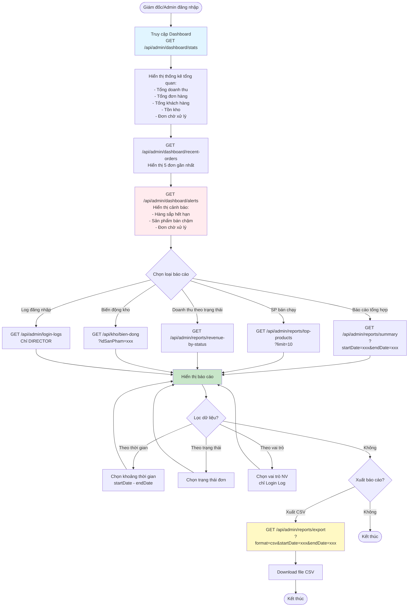

# ĐÁNH GIÁ & ĐỀ XUẤT USE CASE CHO LVTN

## **HIỆN TẠI TRONG LVTN (9 UC)**

### ✅ **UC-01: Đặt hàng**
- **Trạng thái**: CÓ HÌNH - ĐẦY ĐỦ
- **Đánh giá**: Tốt, bao gồm cả COD và PayOS
- **Gợi ý**: Cần làm rõ workflow FEFO trong mô tả

### ✅ **UC-02: Xác nhận đơn hàng**
- **Trạng thái**: CÓ HÌNH - ĐẦY ĐỦ
- **Đánh giá**: Tốt, có trừ kho và FEFO
- **Gợi ý**: Thêm luồng ghi log biến động kho

### ✅ **UC-03: Chốt thầu NCC**
- **Trạng thái**: CÓ HÌNH - CẦN BỔ SUNG
- **Thiếu**: UPDATE gia_ban khi chốt thầu
- **Thiếu**: Tính DSV (Q = V×T + V×5 - I)
- **Gợi ý**: Thêm 2 bước này vào sơ đồ

### ✅ **UC-04: Đổi trả hàng**
- **Trạng thái**: CÓ HÌNH - CẦN BỔ SUNG
- **Thiếu**: 3 bước workflow (CHO_DUYET → CHO_HOAN_TIEN → HOAN_TIEN_TC)
- **Thiếu**: Hàng trả về đi vào `so_luong_hang_loi`, KHÔNG hoàn kho
- **Gợi ý**: Làm rõ hàng lỗi chờ trả NCC

### ✅ **UC-05: Đăng ký và xác thực email**
- **Trạng thái**: CÓ HÌNH - ĐẦY ĐỦ
- **Đánh giá**: Tốt
- **Gợi ý**: Thêm luồng "Gửi lại email" và "Kiểm tra trạng thái"

### ✅ **UC-06: Duyệt phiếu nhập kho**
- **Trạng thái**: CÓ HÌNH - CẦN BỔ SUNG
- **Thiếu**: PO Workflow 3 bước:
  1. Kho kiểm tra & xác nhận (cập nhật SL thực nhận, ghi hàng lỗi)
  2. Chờ Admin duyệt cuối
  3. Admin duyệt → Cộng kho + ghi log
- **Gợi ý**: Đây là workflow quan trọng, cần mô tả chi tiết

### ✅ **UC-07: NCC đề xuất sản phẩm mới**
- **Trạng thái**: CÓ HÌNH - CẦN BỔ SUNG
- **Thiếu**: Luồng upload CSV hàng loạt (parse → preview → confirm)
- **Thiếu**: Admin duyệt → thêm vào san_pham
- **Gợi ý**: Thêm 2 cách đề xuất (form đơn lẻ + CSV bulk)

### ✅ **UC-08: Xác nhận đơn hàng qua QR code**
- **Trạng thái**: CÓ HÌNH - CẦN BỔ SUNG
- **Thiếu**: Validate mã vận đơn
- **Thiếu**: API tra cứu `/api/don-hang/tracking/{maVanDon}`
- **Thiếu**: Luồng "Tạo lại QR" khi bị mất
- **Gợi ý**: Làm rõ flow scan → validate → hiển thị thông tin

### ✅ **UC-09: Quản lý chiến dịch khuyến mại**
- **Trạng thái**: CÓ HÌNH - CẦN BỔ SUNG
- **Thiếu**: 4 giai đoạn đầy đủ:
  1. Admin tạo chiến dịch
  2. Admin gán sản phẩm (modal checkbox)
  3. Auto-display theo thời gian (trang chủ)
  4. Áp dụng giảm giá khi checkout
- **Gợi ý**: Làm rõ cơ chế tự động hiển thị

---

## **📋 ĐỀ XUẤT BỔ SUNG 3 UC QUAN TRỌNG**

Dựa trên phân tích code, tôi đề xuất thêm 3 UC để LVTN đầy đủ hơn:

### **🆕 UC-10: Tìm kiếm và duyệt sản phẩm (Khách hàng)**
**Lý do**: Đây là chức năng cốt lõi, chiếm >30% traffic

**Bao gồm:**
- Tìm kiếm theo tên, danh mục, thương hiệu
- Lọc theo nồng độ, dung tích, giá
- Sắp xếp (giá tăng/giảm, mới nhất)
- Xem chi tiết sản phẩm
- Xem sản phẩm liên quan

**Actor**: Khách hàng

**Độ ưu tiên**: ⭐⭐⭐ CAO

---

### **🆕 UC-11: Quản lý giỏ hàng (Khách hàng)**
**Lý do**: Không thể thiếu trong hệ thống e-commerce

**Bao gồm:**
- Thêm sản phẩm vào giỏ
- Cập nhật số lượng
- Xóa sản phẩm
- Xem tổng tiền tạm tính
- Áp dụng mã giảm giá (nếu có chiến dịch)

**Actor**: Khách hàng

**Độ ưu tiên**: ⭐⭐⭐ CAO

---

### **🆕 UC-12: Báo cáo và thống kê (Giám đốc/Admin)**
**Lý do**: Chức năng quản lý quan trọng để đánh giá kinh doanh

**Bao gồm:**
- Dashboard tổng quan (doanh thu, đơn hàng, khách hàng)
- Báo cáo sản phẩm bán chạy
- Báo cáo doanh thu theo trạng thái
- Báo cáo biến động kho
- Xuất CSV
- Xem log đăng nhập (bảo mật)

**Actor**: Giám đốc/Director (chính), Admin (phụ)

**Độ ưu tiên**: ⭐⭐⭐ CAO

---

## **💡 ĐỀ XUẤT SẮP XẾP LẠI 12 UC CHO LVTN**

### **Nhóm 1: KHÁCH HÀNG (5 UC)**
```
UC-01: Đăng ký và xác thực email ✅
UC-02: Tìm kiếm và duyệt sản phẩm 🆕
UC-03: Quản lý giỏ hàng 🆕
UC-04: Đặt hàng (COD + PayOS) ✅
UC-05: Đổi trả hàng ✅ (cần bổ sung)
```

### **Nhóm 2: ADMIN/QUẢN LÝ (4 UC)**
```
UC-06: Xác nhận đơn hàng (FEFO) ✅
UC-07: Xác nhận đơn qua QR code ✅ (cần bổ sung)
UC-08: Quản lý chiến dịch khuyến mại ✅ (cần bổ sung)
UC-09: Duyệt phiếu nhập kho (PO Workflow) ✅ (cần bổ sung)
```

### **Nhóm 3: NCC & GIÁM ĐỐC (3 UC)**
```
UC-10: Chốt thầu NCC ✅ (cần bổ sung)
UC-11: NCC đề xuất sản phẩm mới ✅ (cần bổ sung)
UC-12: Báo cáo và thống kê 🆕
```

---

## **📐 HƯỚNG DẪN VẼ 3 UC MỚI BẰNG MERMAID**

### **UC-10: Tìm kiếm và duyệt sản phẩm**

```mermaid
flowchart TD
    Start([Khách hàng truy cập trang chủ]) --> ViewHome[Xem danh sách sản phẩm]
    
    ViewHome --> SearchAction{Hành động}
    
    SearchAction -->|Tìm kiếm| InputKeyword[Nhập từ khóa<br/>GET /api/catalog/san-pham/search?kw=xxx]
    SearchAction -->|Lọc| SelectFilter[Chọn bộ lọc]
    SearchAction -->|Xem chi tiết| ViewDetail
    
    InputKeyword --> DisplayResults[Hiển thị kết quả]
    
    SelectFilter --> FilterOptions{Chọn tiêu chí}
    FilterOptions -->|Danh mục| FilterCategory[?danhMucId=xxx]
    FilterOptions -->|Thương hiệu| FilterBrand[?thuongHieuId=xxx]
    FilterOptions -->|Nồng độ| FilterConcentration[?nongDoMin=xx&nongDoMax=xx]
    FilterOptions -->|Dung tích| FilterVolume[?dungTich=xxx]
    FilterOptions -->|Giá| FilterPrice[?minGia=xxx&maxGia=xxx]
    
    FilterCategory --> DisplayResults
    FilterBrand --> DisplayResults
    FilterConcentration --> DisplayResults
    FilterVolume --> DisplayResults
    FilterPrice --> DisplayResults
    
    DisplayResults --> SortOptions{Sắp xếp?}
    SortOptions -->|Giá tăng| SortPriceAsc[?sortBy=gia&sortDir=asc]
    SortOptions -->|Giá giảm| SortPriceDesc[?sortBy=gia&sortDir=desc]
    SortOptions -->|Mới nhất| SortNew[?sortBy=idSanPham&sortDir=desc]
    SortOptions -->|Không| DisplayPagination
    
    SortPriceAsc --> DisplayPagination
    SortPriceDesc --> DisplayPagination
    SortNew --> DisplayPagination
    
    DisplayPagination[Hiển thị danh sách<br/>có phân trang] --> ViewDetail{Xem chi tiết SP?}
    
    ViewDetail -->|Có| GetDetail[GET /api/san-pham/{id}]
    ViewDetail -->|Không| End1([Kết thúc])
    
    GetDetail --> DisplayDetail[Hiển thị chi tiết:<br/>- Thông tin SP<br/>- Giá, nồng độ, dung tích<br/>- Mô tả<br/>- Hình ảnh]
    
    DisplayDetail --> LoadReviews[GET /api/reviews/product/{productId}<br/>Xem đánh giá]
    
    LoadReviews --> LoadRelated[GET /api/san-pham/{id}/related<br/>Xem SP liên quan]
    
    LoadRelated --> CustomerAction{Hành động tiếp?}
    CustomerAction -->|Thêm giỏ hàng| AddToCart[→ UC-03: Quản lý giỏ]
    CustomerAction -->|Tiếp tục xem| ViewHome
    CustomerAction -->|Thoát| End2([Kết thúc])
    
    AddToCart --> End3([Kết thúc])
    
    style GetDetail fill:#E1F5FF
    style DisplayDetail fill:#C8E6C9
    style LoadReviews fill:#FFF9C4
```

---

### **UC-11: Quản lý giỏ hàng**

```mermaid
flowchart TD
    Start([Khách hàng đã đăng nhập]) --> ViewCart[Xem giỏ hàng<br/>GET /api/cart/dto?userId=xxx]
    
    ViewCart --> CheckEmpty{Giỏ hàng<br/>có sản phẩm?}
    
    CheckEmpty -->|Trống| EmptyMsg[Hiển thị: Giỏ hàng trống]
    EmptyMsg --> BackToShop[Quay lại mua sắm]
    BackToShop --> End1([Kết thúc])
    
    CheckEmpty -->|Có SP| DisplayCart[Hiển thị danh sách SP:<br/>- Tên, hình ảnh<br/>- Giá, số lượng<br/>- Tạm tính từng SP]
    
    DisplayCart --> CalculateTotal[Tính tổng tiền tạm tính]
    
    CalculateTotal --> CheckCampaign{Có chiến dịch<br/>khuyến mãi?}
    
    CheckCampaign -->|Có| GetActiveCampaign[GET /api/public/campaigns/active]
    GetActiveCampaign --> ApplyDiscount[Áp dụng giảm giá<br/>Hiển thị % giảm]
    ApplyDiscount --> DisplayTotalWithDiscount[Hiển thị:<br/>- Tổng tiền gốc<br/>- Giảm giá<br/>- Tổng tiền sau giảm]
    
    CheckCampaign -->|Không| DisplayTotalNormal[Hiển thị tổng tiền]
    
    DisplayTotalWithDiscount --> CustomerAction
    DisplayTotalNormal --> CustomerAction
    
    CustomerAction{Hành động}
    
    CustomerAction -->|Thêm SP| AddItem[POST /api/cart/items<br/>Body: {userId, sanPhamId, soLuong}]
    CustomerAction -->|Cập nhật SL| UpdateItem[PUT /api/cart/items<br/>Body: {userId, sanPhamId, soLuong}]
    CustomerAction -->|Xóa SP| DeleteItem[DELETE /api/cart/items?userId=xx&sanPhamId=xx]
    CustomerAction -->|Xóa tất cả| ClearCart[DELETE /api/cart?userId=xxx]
    CustomerAction -->|Thanh toán| Checkout[→ UC-04: Đặt hàng]
    
    AddItem --> RefreshCart[Làm mới giỏ hàng]
    UpdateItem --> ValidateStock{Kiểm tra tồn kho}
    ValidateStock -->|Đủ| RefreshCart
    ValidateStock -->|Không đủ| ErrorStock[Thông báo: Không đủ hàng]
    ErrorStock --> RefreshCart
    
    DeleteItem --> RefreshCart
    ClearCart --> EmptyMsg
    
    RefreshCart --> ViewCart
    
    Checkout --> End2([Kết thúc])
    
    style AddItem fill:#C8E6C9
    style UpdateItem fill:#FFF9C4
    style DeleteItem fill:#FFEBEE
    style ApplyDiscount fill:#E1F5FF
```

---

### **UC-12: Báo cáo và thống kê**



---

## **✅ TỔNG KẾT ĐỀ XUẤT**

### **Nên giữ nguyên (9 UC hiện tại):**
✅ Tất cả 9 UC đều quan trọng

### **Cần bổ sung chi tiết (6 UC):**
⚠️ UC-03: Chốt thầu NCC
⚠️ UC-04: Đổi trả hàng
⚠️ UC-06: Duyệt phiếu nhập kho
⚠️ UC-07: NCC đề xuất SP
⚠️ UC-08: QR code
⚠️ UC-09: Khuyến mãi

### **Nên thêm mới (3 UC):**
🆕 UC-10: Tìm kiếm và duyệt sản phẩm (Khách hàng)
🆕 UC-11: Quản lý giỏ hàng (Khách hàng)
🆕 UC-12: Báo cáo và thống kê (Giám đốc)

### **Tổng cộng: 12 USE CASES**

---

## **🎯 ĐỘ ƯU TIÊN THỰC HIỆN**

### **Ưu tiên CAO (làm trước):**
1. ✅ Bổ sung UC-04: Đổi trả (3 bước workflow)
2. ✅ Bổ sung UC-06: PO Workflow (quan trọng nhất)
3. 🆕 Thêm UC-10: Tìm kiếm sản phẩm (core feature)
4. 🆕 Thêm UC-11: Giỏ hàng (core feature)

### **Ưu tiên TRUNG BÌNH:**
5. ✅ Bổ sung UC-03: Chốt thầu (UPDATE gia_ban + DSV)
6. ✅ Bổ sung UC-07: NCC đề xuất (CSV workflow)
7. ✅ Bổ sung UC-09: Khuyến mãi (4 giai đoạn)
8. 🆕 Thêm UC-12: Báo cáo

### **Ưu tiên THẤP:**
9. ✅ Bổ sung UC-08: QR code (validate + API)

---

## **📄 FILE MERMAID ĐÃ TẠO**

Tôi đã tạo sơ đồ Mermaid cho 3 UC mới ở trên. Bạn có thể:
1. Copy vào https://mermaid.live để preview
2. Export PNG để chèn vào Word
3. Hoặc dùng VS Code extension "Markdown Preview Mermaid Support"

